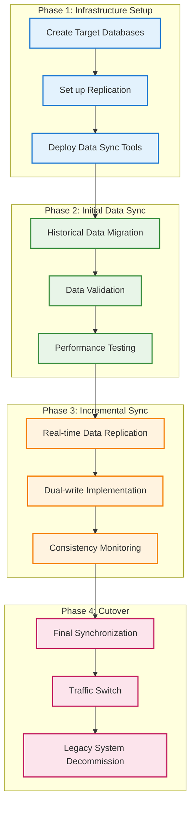
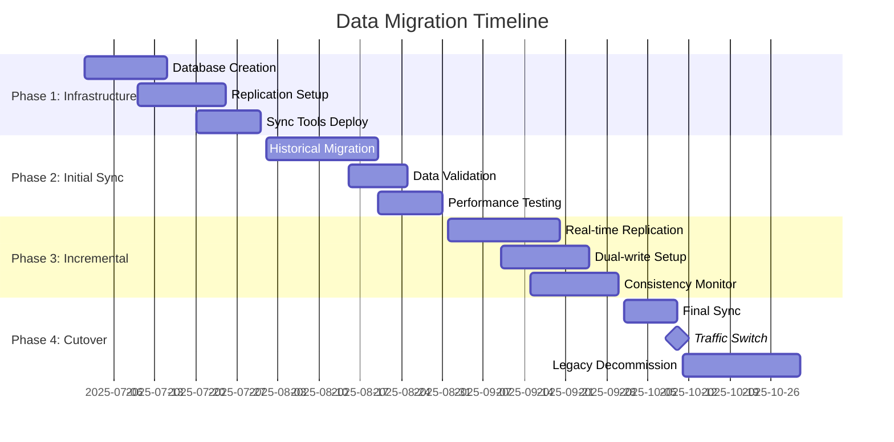

# Data Migration Strategy and Database Design

## 1. Database Migration Strategy

### 1.1 Current Monolithic Database Analysis

**Current Database Structure:**
```sql
-- Current Monolithic Database Schema
CREATE DATABASE globalpay_monolith;

USE globalpay_monolith;

-- All entities in single database
CREATE TABLE users (
    id BIGINT AUTO_INCREMENT PRIMARY KEY,
    username VARCHAR(255) UNIQUE NOT NULL,
    email VARCHAR(255) UNIQUE NOT NULL,
    password_hash VARCHAR(255) NOT NULL,
    first_name VARCHAR(100),
    last_name VARCHAR(100),
    phone_number VARCHAR(20),
    status ENUM('ACTIVE', 'INACTIVE', 'SUSPENDED'),
    created_at TIMESTAMP DEFAULT CURRENT_TIMESTAMP,
    updated_at TIMESTAMP DEFAULT CURRENT_TIMESTAMP ON UPDATE CURRENT_TIMESTAMP
);

CREATE TABLE accounts (
    id BIGINT AUTO_INCREMENT PRIMARY KEY,
    user_id BIGINT NOT NULL,
    account_number VARCHAR(50) UNIQUE NOT NULL,
    balance DECIMAL(15,2) DEFAULT 0.00,
    currency VARCHAR(3) DEFAULT 'USD',
    status ENUM('ACTIVE', 'INACTIVE', 'FROZEN'),
    created_at TIMESTAMP DEFAULT CURRENT_TIMESTAMP,
    updated_at TIMESTAMP DEFAULT CURRENT_TIMESTAMP ON UPDATE CURRENT_TIMESTAMP,
    FOREIGN KEY (user_id) REFERENCES users(id)
);

CREATE TABLE transactions (
    id BIGINT AUTO_INCREMENT PRIMARY KEY,
    from_account_id BIGINT,
    to_account_id BIGINT,
    amount DECIMAL(15,2) NOT NULL,
    transaction_type ENUM('TRANSFER', 'DEPOSIT', 'WITHDRAWAL'),
    status ENUM('PENDING', 'COMPLETED', 'FAILED'),
    description TEXT,
    created_at TIMESTAMP DEFAULT CURRENT_TIMESTAMP,
    completed_at TIMESTAMP NULL,
    FOREIGN KEY (from_account_id) REFERENCES accounts(id),
    FOREIGN KEY (to_account_id) REFERENCES accounts(id)
);
```

### 1.2 Target Microservices Database Design

#### 1.2.1 User Management Service Database

```sql
-- User Management Service Database
CREATE DATABASE user_management_db;
USE user_management_db;

CREATE TABLE users (
    id VARCHAR(36) PRIMARY KEY,  -- UUID for better distribution
    email VARCHAR(255) UNIQUE NOT NULL,
    phone_number VARCHAR(20) UNIQUE,
    password_hash VARCHAR(255) NOT NULL,
    first_name VARCHAR(100) NOT NULL,
    last_name VARCHAR(100) NOT NULL,
    date_of_birth DATE,
    status ENUM('ACTIVE', 'INACTIVE', 'SUSPENDED', 'PENDING_VERIFICATION') DEFAULT 'PENDING_VERIFICATION',
    kyc_status ENUM('NOT_STARTED', 'IN_PROGRESS', 'COMPLETED', 'REJECTED') DEFAULT 'NOT_STARTED',
    preferred_language VARCHAR(10) DEFAULT 'en',
    timezone VARCHAR(50) DEFAULT 'UTC',
    created_at TIMESTAMP DEFAULT CURRENT_TIMESTAMP,
    updated_at TIMESTAMP DEFAULT CURRENT_TIMESTAMP ON UPDATE CURRENT_TIMESTAMP,
    last_login_at TIMESTAMP NULL,
    failed_login_attempts INT DEFAULT 0,
    locked_until TIMESTAMP NULL,
    email_verified BOOLEAN DEFAULT FALSE,
    phone_verified BOOLEAN DEFAULT FALSE,
    two_factor_enabled BOOLEAN DEFAULT FALSE,
    
    -- Legacy mapping for migration
    legacy_user_id BIGINT UNIQUE,
    migration_status ENUM('PENDING', 'IN_PROGRESS', 'COMPLETED') DEFAULT 'PENDING',
    
    INDEX idx_email (email),
    INDEX idx_phone (phone_number),
    INDEX idx_status (status),
    INDEX idx_kyc_status (kyc_status),
    INDEX idx_legacy_id (legacy_user_id),
    INDEX idx_migration_status (migration_status)
);

CREATE TABLE user_addresses (
    id VARCHAR(36) PRIMARY KEY,
    user_id VARCHAR(36) NOT NULL,
    address_type ENUM('HOME', 'WORK', 'BILLING') DEFAULT 'HOME',
    address_line1 VARCHAR(255) NOT NULL,
    address_line2 VARCHAR(255),
    city VARCHAR(100) NOT NULL,
    state VARCHAR(100),
    postal_code VARCHAR(20),
    country VARCHAR(100) NOT NULL,
    is_primary BOOLEAN DEFAULT FALSE,
    created_at TIMESTAMP DEFAULT CURRENT_TIMESTAMP,
    updated_at TIMESTAMP DEFAULT CURRENT_TIMESTAMP ON UPDATE CURRENT_TIMESTAMP,
    
    FOREIGN KEY (user_id) REFERENCES users(id) ON DELETE CASCADE,
    INDEX idx_user_id (user_id),
    INDEX idx_address_type (address_type)
);

CREATE TABLE user_sessions (
    id VARCHAR(36) PRIMARY KEY,
    user_id VARCHAR(36) NOT NULL,
    session_token VARCHAR(500) NOT NULL,
    device_info JSON,
    ip_address VARCHAR(45),
    user_agent TEXT,
    created_at TIMESTAMP DEFAULT CURRENT_TIMESTAMP,
    expires_at TIMESTAMP NOT NULL,
    is_active BOOLEAN DEFAULT TRUE,
    
    FOREIGN KEY (user_id) REFERENCES users(id) ON DELETE CASCADE,
    INDEX idx_user_id (user_id),
    INDEX idx_session_token (session_token),
    INDEX idx_expires_at (expires_at)
);
```

#### 1.2.2 Account Management Service Database

```sql
-- Account Management Service Database
CREATE DATABASE account_management_db;
USE account_management_db;

CREATE TABLE accounts (
    id VARCHAR(36) PRIMARY KEY,
    user_id VARCHAR(36) NOT NULL,  -- Reference to user service
    account_number VARCHAR(50) UNIQUE NOT NULL,
    account_type ENUM('PERSONAL', 'BUSINESS', 'SAVINGS', 'MERCHANT') DEFAULT 'PERSONAL',
    currency VARCHAR(3) NOT NULL DEFAULT 'USD',
    status ENUM('ACTIVE', 'INACTIVE', 'FROZEN', 'CLOSED') DEFAULT 'ACTIVE',
    
    -- Balance management with better precision
    available_balance DECIMAL(19,4) DEFAULT 0.0000,
    reserved_balance DECIMAL(19,4) DEFAULT 0.0000,
    total_balance DECIMAL(19,4) GENERATED ALWAYS AS (available_balance + reserved_balance) STORED,
    
    -- Limits and controls
    daily_transaction_limit DECIMAL(19,4) DEFAULT 10000.0000,
    monthly_transaction_limit DECIMAL(19,4) DEFAULT 100000.0000,
    minimum_balance DECIMAL(19,4) DEFAULT 0.0000,
    
    -- Audit fields
    created_at TIMESTAMP DEFAULT CURRENT_TIMESTAMP,
    updated_at TIMESTAMP DEFAULT CURRENT_TIMESTAMP ON UPDATE CURRENT_TIMESTAMP,
    last_transaction_at TIMESTAMP NULL,
    
    -- Legacy mapping
    legacy_account_id BIGINT UNIQUE,
    migration_status ENUM('PENDING', 'IN_PROGRESS', 'COMPLETED') DEFAULT 'PENDING',
    
    INDEX idx_user_id (user_id),
    INDEX idx_account_number (account_number),
    INDEX idx_status (status),
    INDEX idx_currency (currency),
    INDEX idx_legacy_id (legacy_account_id),
    INDEX idx_last_transaction (last_transaction_at)
);

CREATE TABLE account_balance_history (
    id VARCHAR(36) PRIMARY KEY,
    account_id VARCHAR(36) NOT NULL,
    balance_before DECIMAL(19,4) NOT NULL,
    balance_after DECIMAL(19,4) NOT NULL,
    change_amount DECIMAL(19,4) NOT NULL,
    change_type ENUM('CREDIT', 'DEBIT', 'RESERVE', 'RELEASE') NOT NULL,
    transaction_id VARCHAR(36),
    reference_id VARCHAR(100),
    description TEXT,
    created_at TIMESTAMP DEFAULT CURRENT_TIMESTAMP,
    
    FOREIGN KEY (account_id) REFERENCES accounts(id) ON DELETE CASCADE,
    INDEX idx_account_id (account_id),
    INDEX idx_transaction_id (transaction_id),
    INDEX idx_created_at (created_at)
);

CREATE TABLE account_limits (
    id VARCHAR(36) PRIMARY KEY,
    account_id VARCHAR(36) NOT NULL,
    limit_type ENUM('DAILY_TRANSACTION', 'MONTHLY_TRANSACTION', 'SINGLE_TRANSACTION', 'MINIMUM_BALANCE') NOT NULL,
    limit_amount DECIMAL(19,4) NOT NULL,
    currency VARCHAR(3) NOT NULL,
    is_active BOOLEAN DEFAULT TRUE,
    effective_from TIMESTAMP DEFAULT CURRENT_TIMESTAMP,
    effective_until TIMESTAMP NULL,
    created_by VARCHAR(36),
    created_at TIMESTAMP DEFAULT CURRENT_TIMESTAMP,
    
    FOREIGN KEY (account_id) REFERENCES accounts(id) ON DELETE CASCADE,
    INDEX idx_account_id (account_id),
    INDEX idx_limit_type (limit_type),
    INDEX idx_effective_dates (effective_from, effective_until)
);
```

#### 1.2.3 Transaction Processing Service Database

```sql
-- Transaction Processing Service Database
CREATE DATABASE transaction_processing_db;
USE transaction_processing_db;

CREATE TABLE transactions (
    id VARCHAR(36) PRIMARY KEY,
    transaction_number VARCHAR(50) UNIQUE NOT NULL,
    
    -- Account references (could be external service calls)
    source_account_id VARCHAR(36),
    target_account_id VARCHAR(36),
    
    -- Transaction details
    amount DECIMAL(19,4) NOT NULL,
    currency VARCHAR(3) NOT NULL,
    exchange_rate DECIMAL(10,6) DEFAULT 1.000000,
    fee_amount DECIMAL(19,4) DEFAULT 0.0000,
    net_amount DECIMAL(19,4) GENERATED ALWAYS AS (amount - fee_amount) STORED,
    
    -- Transaction classification
    transaction_type ENUM('TRANSFER', 'DEPOSIT', 'WITHDRAWAL', 'PAYMENT', 'REFUND', 'FEE') NOT NULL,
    transaction_category ENUM('P2P', 'MERCHANT', 'BILL_PAYMENT', 'TOP_UP', 'CASH_OUT', 'INTERNAL') NOT NULL,
    
    -- Status management
    status ENUM('PENDING', 'PROCESSING', 'COMPLETED', 'FAILED', 'CANCELLED', 'REVERSED') NOT NULL DEFAULT 'PENDING',
    
    -- References and descriptions
    reference_id VARCHAR(100),
    external_reference VARCHAR(100),
    description TEXT,
    merchant_info JSON,
    
    -- Timing
    created_at TIMESTAMP DEFAULT CURRENT_TIMESTAMP,
    updated_at TIMESTAMP DEFAULT CURRENT_TIMESTAMP ON UPDATE CURRENT_TIMESTAMP,
    processed_at TIMESTAMP NULL,
    completed_at TIMESTAMP NULL,
    failed_at TIMESTAMP NULL,
    
    -- Error handling
    failure_reason TEXT,
    retry_count INT DEFAULT 0,
    max_retry_count INT DEFAULT 3,
    
    -- Idempotency and deduplication
    idempotency_key VARCHAR(100) UNIQUE,
    
    -- Legacy mapping
    legacy_transaction_id BIGINT UNIQUE,
    migration_status ENUM('PENDING', 'IN_PROGRESS', 'COMPLETED') DEFAULT 'PENDING',
    
    INDEX idx_source_account (source_account_id),
    INDEX idx_target_account (target_account_id),
    INDEX idx_status (status),
    INDEX idx_transaction_type (transaction_type),
    INDEX idx_created_at (created_at),
    INDEX idx_reference_id (reference_id),
    INDEX idx_idempotency (idempotency_key),
    INDEX idx_legacy_id (legacy_transaction_id)
);

CREATE TABLE transaction_steps (
    id VARCHAR(36) PRIMARY KEY,
    transaction_id VARCHAR(36) NOT NULL,
    step_number INT NOT NULL,
    step_type ENUM('VALIDATE', 'RESERVE', 'EXECUTE', 'CONFIRM', 'COMPENSATE') NOT NULL,
    step_status ENUM('PENDING', 'COMPLETED', 'FAILED', 'SKIPPED') NOT NULL DEFAULT 'PENDING',
    step_data JSON,
    error_message TEXT,
    executed_at TIMESTAMP NULL,
    duration_ms INT,
    created_at TIMESTAMP DEFAULT CURRENT_TIMESTAMP,
    
    FOREIGN KEY (transaction_id) REFERENCES transactions(id) ON DELETE CASCADE,
    UNIQUE KEY uk_transaction_step (transaction_id, step_number),
    INDEX idx_transaction_id (transaction_id),
    INDEX idx_step_status (step_status)
);

-- Event Store for Transaction Events
CREATE TABLE transaction_events (
    id VARCHAR(36) PRIMARY KEY,
    aggregate_id VARCHAR(36) NOT NULL,  -- transaction_id
    aggregate_type VARCHAR(50) NOT NULL DEFAULT 'Transaction',
    event_type VARCHAR(100) NOT NULL,
    event_data JSON NOT NULL,
    event_version BIGINT NOT NULL,
    correlation_id VARCHAR(36),
    causation_id VARCHAR(36),
    occurred_at TIMESTAMP DEFAULT CURRENT_TIMESTAMP,
    processed BOOLEAN DEFAULT FALSE,
    
    UNIQUE KEY uk_aggregate_version (aggregate_id, event_version),
    INDEX idx_aggregate_id (aggregate_id),
    INDEX idx_event_type (event_type),
    INDEX idx_occurred_at (occurred_at),
    INDEX idx_processed (processed)
);

-- Ledger for double-entry bookkeeping
CREATE TABLE ledger_entries (
    id VARCHAR(36) PRIMARY KEY,
    transaction_id VARCHAR(36) NOT NULL,
    account_id VARCHAR(36) NOT NULL,
    entry_type ENUM('DEBIT', 'CREDIT') NOT NULL,
    amount DECIMAL(19,4) NOT NULL,
    currency VARCHAR(3) NOT NULL,
    balance_before DECIMAL(19,4) NOT NULL,
    balance_after DECIMAL(19,4) NOT NULL,
    entry_date TIMESTAMP DEFAULT CURRENT_TIMESTAMP,
    posting_date DATE GENERATED ALWAYS AS (DATE(entry_date)) STORED,
    description TEXT,
    reference_number VARCHAR(100),
    
    FOREIGN KEY (transaction_id) REFERENCES transactions(id),
    INDEX idx_transaction_id (transaction_id),
    INDEX idx_account_id (account_id),
    INDEX idx_posting_date (posting_date),
    INDEX idx_entry_date (entry_date)
);
```

### 1.3 Data Migration Process

#### 1.3.1 Migration Strategy Overview



**Detailed Migration Timeline:**


#### 1.3.2 Data Migration Implementation

```java
@Service
@Slf4j
public class DataMigrationService {
    
    @Autowired
    private LegacyUserRepository legacyUserRepository;
    
    @Autowired
    private NewUserRepository newUserRepository;
    
    @Autowired
    private DataValidationService dataValidationService;
    
    @Transactional
    public void migrateUsers(int batchSize, int offset) {
        log.info("Starting user migration - batch size: {}, offset: {}", batchSize, offset);
        
        List<LegacyUser> legacyUsers = legacyUserRepository.findBatch(batchSize, offset);
        
        for (LegacyUser legacyUser : legacyUsers) {
            try {
                // Transform legacy user to new format
                User newUser = transformUser(legacyUser);
                
                // Validate data integrity
                dataValidationService.validateUser(newUser);
                
                // Save to new database
                newUserRepository.save(newUser);
                
                // Mark as migrated
                legacyUser.setMigrationStatus(MigrationStatus.COMPLETED);
                legacyUserRepository.save(legacyUser);
                
                log.debug("Successfully migrated user: {}", legacyUser.getId());
                
            } catch (Exception e) {
                log.error("Failed to migrate user: {}", legacyUser.getId(), e);
                
                // Mark as failed for retry
                legacyUser.setMigrationStatus(MigrationStatus.FAILED);
                legacyUser.setMigrationError(e.getMessage());
                legacyUserRepository.save(legacyUser);
            }
        }
    }
    
    private User transformUser(LegacyUser legacyUser) {
        return User.builder()
            .id(UUID.randomUUID().toString())
            .email(legacyUser.getEmail())
            .phoneNumber(legacyUser.getPhoneNumber())
            .passwordHash(legacyUser.getPasswordHash())
            .firstName(legacyUser.getFirstName())
            .lastName(legacyUser.getLastName())
            .status(mapUserStatus(legacyUser.getStatus()))
            .kycStatus(KycStatus.NOT_STARTED)
            .legacyUserId(legacyUser.getId())
            .migrationStatus(MigrationStatus.COMPLETED)
            .createdAt(legacyUser.getCreatedAt())
            .updatedAt(LocalDateTime.now())
            .build();
    }
    
    private UserStatus mapUserStatus(String legacyStatus) {
        switch (legacyStatus.toUpperCase()) {
            case "ACTIVE": return UserStatus.ACTIVE;
            case "INACTIVE": return UserStatus.INACTIVE;
            case "SUSPENDED": return UserStatus.SUSPENDED;
            default: return UserStatus.PENDING_VERIFICATION;
        }
    }
}

@Component
public class DataValidationService {
    
    public void validateUser(User user) throws ValidationException {
        if (user.getEmail() == null || !isValidEmail(user.getEmail())) {
            throw new ValidationException("Invalid email format");
        }
        
        if (user.getFirstName() == null || user.getFirstName().trim().isEmpty()) {
            throw new ValidationException("First name is required");
        }
        
        if (user.getLastName() == null || user.getLastName().trim().isEmpty()) {
            throw new ValidationException("Last name is required");
        }
        
        // Additional validation rules...
    }
    
    public void validateAccount(Account account) throws ValidationException {
        if (account.getAccountNumber() == null || account.getAccountNumber().trim().isEmpty()) {
            throw new ValidationException("Account number is required");
        }
        
        if (account.getAvailableBalance().compareTo(BigDecimal.ZERO) < 0) {
            throw new ValidationException("Available balance cannot be negative");
        }
        
        // Additional validation rules...
    }
    
    private boolean isValidEmail(String email) {
        return email.matches("^[A-Za-z0-9+_.-]+@[A-Za-z0-9.-]+\\.[A-Za-z]{2,}$");
    }
}
```

#### 1.3.3 Data Consistency Monitoring

```java
@Component
@Scheduled(fixedRate = 300000) // Every 5 minutes
public class DataConsistencyMonitor {
    
    @Autowired
    private LegacyDataRepository legacyRepository;
    
    @Autowired
    private NewDataRepository newRepository;
    
    @Autowired
    private AlertService alertService;
    
    public void checkUserDataConsistency() {
        log.info("Starting user data consistency check");
        
        // Count total users in both systems
        long legacyUserCount = legacyRepository.countUsers();
        long newUserCount = newRepository.countMigratedUsers();
        
        if (Math.abs(legacyUserCount - newUserCount) > 10) {
            alertService.sendAlert(
                "Data Inconsistency Alert",
                String.format("User count mismatch: Legacy=%d, New=%d", legacyUserCount, newUserCount)
            );
        }
        
        // Sample data validation
        List<String> sampleUserIds = legacyRepository.getSampleUserIds(100);
        for (String userId : sampleUserIds) {
            validateUserData(userId);
        }
    }
    
    public void checkBalanceConsistency() {
        log.info("Starting balance consistency check");
        
        // Get total balance from both systems
        BigDecimal legacyTotalBalance = legacyRepository.getTotalBalance();
        BigDecimal newTotalBalance = newRepository.getTotalBalance();
        
        BigDecimal difference = legacyTotalBalance.subtract(newTotalBalance).abs();
        BigDecimal threshold = new BigDecimal("100.00"); // $100 threshold
        
        if (difference.compareTo(threshold) > 0) {
            alertService.sendCriticalAlert(
                "Balance Inconsistency Alert",
                String.format("Total balance mismatch: Legacy=%s, New=%s, Difference=%s", 
                    legacyTotalBalance, newTotalBalance, difference)
            );
        }
    }
    
    private void validateUserData(String legacyUserId) {
        try {
            LegacyUser legacyUser = legacyRepository.findById(legacyUserId);
            User newUser = newRepository.findByLegacyId(legacyUserId);
            
            if (newUser == null) {
                alertService.sendAlert("Missing User", "User not found in new system: " + legacyUserId);
                return;
            }
            
            // Validate key fields
            if (!legacyUser.getEmail().equals(newUser.getEmail())) {
                alertService.sendAlert("Email Mismatch", 
                    String.format("User %s email mismatch: %s vs %s", 
                        legacyUserId, legacyUser.getEmail(), newUser.getEmail()));
            }
            
            // Additional field validations...
            
        } catch (Exception e) {
            log.error("Error validating user data for ID: {}", legacyUserId, e);
        }
    }
}
```

### 1.4 Database Performance Optimization

#### 1.4.1 Indexing Strategy

```sql
-- User Management Service Indexes
CREATE INDEX idx_users_email_status ON users(email, status);
CREATE INDEX idx_users_phone_verified ON users(phone_number, phone_verified);
CREATE INDEX idx_users_kyc_status ON users(kyc_status);
CREATE INDEX idx_users_created_at ON users(created_at);
CREATE INDEX idx_users_last_login ON users(last_login_at);

-- Account Management Service Indexes
CREATE INDEX idx_accounts_user_status ON accounts(user_id, status);
CREATE INDEX idx_accounts_currency_type ON accounts(currency, account_type);
CREATE INDEX idx_accounts_balance_range ON accounts(available_balance);
CREATE INDEX idx_balance_history_account_date ON account_balance_history(account_id, created_at);

-- Transaction Processing Service Indexes
CREATE INDEX idx_transactions_accounts ON transactions(source_account_id, target_account_id);
CREATE INDEX idx_transactions_status_type ON transactions(status, transaction_type);
CREATE INDEX idx_transactions_amount_range ON transactions(amount);
CREATE INDEX idx_transactions_date_range ON transactions(created_at, completed_at);
CREATE INDEX idx_ledger_account_date ON ledger_entries(account_id, posting_date);
CREATE INDEX idx_events_aggregate_type ON transaction_events(aggregate_id, event_type);
```

#### 1.4.2 Database Partitioning Strategy

```sql
-- Partition transaction tables by date for better performance
ALTER TABLE transactions 
PARTITION BY RANGE (YEAR(created_at)) (
    PARTITION p2023 VALUES LESS THAN (2024),
    PARTITION p2024 VALUES LESS THAN (2025),
    PARTITION p2025 VALUES LESS THAN (2026),
    PARTITION p2026 VALUES LESS THAN (2027),
    PARTITION p_future VALUES LESS THAN MAXVALUE
);

-- Partition ledger entries by posting date
ALTER TABLE ledger_entries 
PARTITION BY RANGE (YEAR(posting_date)) (
    PARTITION p2023 VALUES LESS THAN (2024),
    PARTITION p2024 VALUES LESS THAN (2025),
    PARTITION p2025 VALUES LESS THAN (2026),
    PARTITION p2026 VALUES LESS THAN (2027),
    PARTITION p_future VALUES LESS THAN MAXVALUE
);

-- Partition transaction events by date
ALTER TABLE transaction_events 
PARTITION BY RANGE (YEAR(occurred_at)) (
    PARTITION p2023 VALUES LESS THAN (2024),
    PARTITION p2024 VALUES LESS THAN (2025),
    PARTITION p2025 VALUES LESS THAN (2026),
    PARTITION p2026 VALUES LESS THAN (2027),
    PARTITION p_future VALUES LESS THAN MAXVALUE
);
```

#### 1.4.3 Read Replica Configuration

```sql
-- Read replica configuration for reporting queries
-- Master database handles all writes
-- Read replicas handle reporting and analytics queries

-- Example queries that should use read replicas:

-- Daily transaction summary
SELECT 
    DATE(created_at) as transaction_date,
    transaction_type,
    COUNT(*) as transaction_count,
    SUM(amount) as total_amount,
    AVG(amount) as average_amount
FROM transactions 
WHERE created_at >= DATE_SUB(NOW(), INTERVAL 30 DAY)
GROUP BY DATE(created_at), transaction_type
ORDER BY transaction_date DESC;

-- User activity report
SELECT 
    u.id,
    u.email,
    u.status,
    COUNT(t.id) as transaction_count,
    MAX(t.created_at) as last_transaction_date
FROM users u
LEFT JOIN accounts a ON u.id = a.user_id
LEFT JOIN transactions t ON (a.id = t.source_account_id OR a.id = t.target_account_id)
WHERE u.created_at >= DATE_SUB(NOW(), INTERVAL 90 DAY)
GROUP BY u.id, u.email, u.status
HAVING transaction_count > 0
ORDER BY last_transaction_date DESC;
```

### 1.5 Data Backup and Recovery Strategy

```sql
-- Backup strategy for microservices databases

-- Daily incremental backups
mysqldump --single-transaction --routines --triggers --events \
  --incremental --master-data=2 \
  user_management_db > user_management_backup_$(date +%Y%m%d).sql

-- Weekly full backups
mysqldump --single-transaction --routines --triggers --events \
  --all-databases > full_backup_$(date +%Y%m%d).sql

-- Point-in-time recovery setup
CHANGE MASTER TO
  MASTER_HOST='rds-master-endpoint',
  MASTER_USER='replication_user',
  MASTER_PASSWORD='replication_password',
  MASTER_LOG_FILE='mysql-bin.000001',
  MASTER_LOG_POS=154;

-- Automated backup verification
SELECT 
    SCHEMA_NAME as database_name,
    ROUND(SUM(DATA_LENGTH + INDEX_LENGTH) / 1024 / 1024, 2) as size_mb
FROM information_schema.SCHEMATA s
LEFT JOIN information_schema.TABLES t ON s.SCHEMA_NAME = t.TABLE_SCHEMA
WHERE s.SCHEMA_NAME NOT IN ('information_schema', 'performance_schema', 'mysql', 'sys')
GROUP BY SCHEMA_NAME;
```

This comprehensive data migration and database design strategy provides:

1. **Complete database schemas** for each microservice with proper normalization
2. **Step-by-step migration process** with validation and rollback capabilities
3. **Data consistency monitoring** to ensure integrity during migration
4. **Performance optimization** through proper indexing and partitioning
5. **Backup and recovery strategies** for business continuity

The design ensures zero-downtime migration while maintaining data integrity and performance throughout the transformation process.
