# eWallet Application - Overall Solution Analysis
## Transformation from Monolith to Microservices Architecture

**Document Version:** 1.0  
**Date:** June 29, 2025  
**Target Audience:** Product Designer, Developer, QA  
**Author:** Shazwan  

---

## Executive Summary

This document outlines the transformation strategy for GlobalPay's monolithic e-wallet system to a modern, scalable microservices architecture deployed on Alibaba Cloud. The proposed solution addresses current scalability challenges while ensuring zero-downtime migration and improved system performance.

## Table of Contents

1. [Requirement Analysis](#1-requirement-analysis)
2. [Architecture Overview](#2-architecture-overview)
3. [Overall Process Flow](#3-overall-process-flow)
4. [Implementation Analysis](#4-implementation-analysis)

---

## 1. Requirement Analysis

### 1.1 Current System Analysis

**Current State:**
- Monolithic Java Spring Framework application
- Single MySQL database
- 100,000 daily transactions with peak time struggles
- Tightly coupled modules (user management, account balances, transfers)

**Pain Points:**
- Scalability limitations during peak times
- Difficult feature addition and maintenance
- Monolithic codebase complexity
- Single point of failure

### 1.2 Business Requirements Mind Map


### 1.3 Domain Analysis

Based on Domain-Driven Design principles, the following bounded contexts have been identified:

| Domain | Responsibility | Current Coupling Level |
|--------|---------------|------------------------|
| **User Management** | User registration, authentication, profile management | High |
| **Account Management** | Account creation, balance tracking, account status | High |
| **Transaction Processing** | Payment processing, transfer execution, transaction validation | High |
| **Payment Gateway** | External payment provider integration | Medium |
| **Notification Service** | SMS, email, push notifications | Low |
| **Compliance & Security** | KYC, AML, fraud detection | Medium |
| **Reporting & Analytics** | Transaction reports, user analytics | Low |

---

## 2. Architecture Overview

### 2.1 High-Level Infrastructure Architecture


### 2.2 Microservices Architecture Design

#### 2.2.1 Current Monolithic vs Target Microservices

**Current Monolithic Architecture:**


**Target Microservices Architecture:**


#### 2.2.2 Microservices Breakdown

| Microservice | Responsibilities | Technology Stack | Database |
|--------------|------------------|------------------|----------|
| **User Management Service** | - User registration/authentication<br>- Profile management<br>- KYC verification | Spring Boot, Spring Security, JWT | MySQL RDS |
| **Account Management Service** | - Account creation<br>- Balance management<br>- Account status tracking | Spring Boot, JPA | MySQL RDS |
| **Transaction Processing Service** | - Payment processing<br>- Transfer execution<br>- Transaction validation<br>- Fund movement | Spring Boot, Spring Batch | MySQL RDS + Redis |
| **Payment Gateway Service** | - External payment integration<br>- Payment method management<br>- Currency conversion | Spring Boot, Feign Client | MySQL RDS |
| **Notification Service** | - SMS/Email notifications<br>- Push notifications<br>- Communication preferences | Spring Boot, Message Queue | NoSQL (MongoDB) |
| **Compliance & Security Service** | - Fraud detection<br>- AML monitoring<br>- Risk assessment | Spring Boot, ML libraries | MySQL RDS + Analytics |
| **Reporting & Analytics Service** | - Transaction reports<br>- User analytics<br>- Business intelligence | Spring Boot, Apache Spark | Data Lake (OSS) |
| **Configuration Service** | - System configuration<br>- Feature flags<br>- Environment settings | Spring Cloud Config | MySQL RDS |

### 2.3 High-Level Implementation Plan

#### Phase 1: Foundation (Months 1-2)
- Set up Alibaba Cloud infrastructure
- Implement API Gateway and service mesh
- Create CI/CD pipelines
- Set up monitoring and logging

#### Phase 2: Core Services Migration (Months 3-4)
- Extract User Management Service
- Extract Account Management Service
- Implement event-driven communication

#### Phase 3: Transaction Services (Months 5-6)
- Extract Transaction Processing Service
- Extract Payment Gateway Service
- Implement distributed transaction management

#### Phase 4: Supporting Services (Months 7-8)
- Extract Notification Service
- Extract Compliance & Security Service
- Extract Reporting & Analytics Service

#### Phase 5: Optimization & Cutover (Months 9-10)
- Performance optimization
- Complete migration and monolith decommission
- Final testing and go-live

---

## 3. Overall Process Flow

### 3.1 Core Financial Operations Flow

#### 3.1.1 Account Reload Process


#### 3.1.2 Payment/Transfer Process


#### 3.1.3 Refund Process


### 3.2 Fund Flow Diagram


### 3.3 Application Process Flow

#### 3.3.1 Microservices Integration Flow

```mermaid
sequenceDiagram
    participant CLIENT as Mobile/Web Client
    participant GATEWAY as API Gateway
    participant AUTH as Authentication Service
    participant USER as User Management Service
    participant ACCOUNT as Account Management Service
    participant TXN as Transaction Service
    participant PAYMENT as Payment Gateway Service
    participant NOTIFY as Notification Service
    participant COMPLIANCE as Compliance Service
    participant MQ as Message Queue
    participant CACHE as Redis Cache
    participant DB as Database

    Note over CLIENT, DB: User Login Flow
    CLIENT->>GATEWAY: Login Request
    GATEWAY->>AUTH: Authenticate User
    AUTH->>USER: Validate Credentials
    USER->>DB: Query User Data
    DB-->>USER: User Information
    USER-->>AUTH: User Validated
    AUTH->>CACHE: Cache Session Token
    AUTH-->>GATEWAY: JWT Token
    GATEWAY-->>CLIENT: Login Success + Token

    Note over CLIENT, DB: Transaction Flow
    CLIENT->>GATEWAY: Transaction Request + JWT
    GATEWAY->>AUTH: Validate JWT
    AUTH->>CACHE: Check Token Cache
    CACHE-->>AUTH: Token Valid
    AUTH-->>GATEWAY: Authorized
    
    GATEWAY->>COMPLIANCE: Risk Assessment
    COMPLIANCE->>DB: Check User Risk Profile
    DB-->>COMPLIANCE: Risk Data
    COMPLIANCE-->>GATEWAY: Risk Approved
    
    GATEWAY->>ACCOUNT: Check Balance
    ACCOUNT->>CACHE: Check Cached Balance
    alt Cache Miss
        ACCOUNT->>DB: Query Balance
        DB-->>ACCOUNT: Current Balance
        ACCOUNT->>CACHE: Update Cache
    end
    ACCOUNT-->>GATEWAY: Balance Available
    
    GATEWAY->>TXN: Process Transaction
    TXN->>MQ: Publish Transaction Event
    TXN->>DB: Insert Transaction Record
    
    alt External Payment Required
        TXN->>PAYMENT: Process External Payment
        PAYMENT->>External: Payment Provider API
        External-->>PAYMENT: Payment Response
        PAYMENT-->>TXN: Payment Result
    end
    
    TXN->>ACCOUNT: Update Account Balance
    ACCOUNT->>DB: Update Balance
    ACCOUNT->>CACHE: Update Cached Balance
    TXN-->>GATEWAY: Transaction Complete
    
    GATEWAY->>NOTIFY: Send Notification
    NOTIFY->>MQ: Subscribe to Transaction Events
    NOTIFY->>External: Send SMS/Email/Push
    
    GATEWAY-->>CLIENT: Transaction Success Response
```



### 3.4 Exception Flow / Handling

#### 3.4.1 Exception Scenarios Sequence Diagram


#### 3.4.2 Exception Handling Matrix

| Exception Scenario | Probability | Impact | Detection Method | Response Strategy | SOP |
|-------------------|-------------|---------|------------------|-------------------|-----|
| **Service Unavailability** | Medium | High | Health checks, Circuit breaker | Graceful degradation, Retry with backoff | 1. Activate circuit breaker<br>2. Route to backup service<br>3. Alert on-call engineer<br>4. Investigate root cause |
| **Database Connection Failure** | Low | Critical | Connection monitoring, Query timeouts | Connection pooling, Read replicas | 1. Switch to read replica<br>2. Queue write operations<br>3. Alert DBA team<br>4. Implement connection recovery |
| **Partial Transaction Failure** | Medium | Critical | Transaction monitoring, Consistency checks | Saga pattern, Compensation actions | 1. Execute compensation transaction<br>2. Update transaction status<br>3. Notify affected users<br>4. Manual reconciliation if needed |
| **External Payment Gateway Failure** | Medium | High | API response monitoring, Timeout detection | Multiple gateway support, Fallback routes | 1. Switch to backup payment gateway<br>2. Queue failed transactions<br>3. Retry with exponential backoff<br>4. Manual intervention if persistent |
| **Network Partition** | Low | High | Network monitoring, Latency checks | Regional failover, Data replication | 1. Activate regional backup<br>2. Reroute traffic<br>3. Monitor data consistency<br>4. Sync when partition heals |
| **Data Inconsistency** | Low | Critical | Reconciliation jobs, Audit trails | Event sourcing, CQRS pattern | 1. Stop affected operations<br>2. Run data reconciliation<br>3. Identify root cause<br>4. Apply corrective transactions |
| **Memory/Resource Exhaustion** | Medium | Medium | Resource monitoring, Auto-scaling | Horizontal scaling, Resource limits | 1. Trigger auto-scaling<br>2. Implement circuit breakers<br>3. Optimize resource usage<br>4. Scale additional instances |
| **Security Breach** | Low | Critical | Security monitoring, Anomaly detection | Access revocation, Incident response | 1. Isolate affected systems<br>2. Revoke compromised credentials<br>3. Activate incident response team<br>4. Conduct security audit |
| **Fraud Detection** | Medium | High | ML-based detection, Rule engines | Transaction blocking, Manual review | 1. Block suspicious transactions<br>2. Flag user account<br>3. Initiate manual review<br>4. Notify compliance team |
| **Regulatory Compliance Failure** | Low | Critical | Compliance monitoring, Audit reports | System lockdown, Compliance review | 1. Halt non-compliant operations<br>2. Notify compliance team<br>3. Conduct audit review<br>4. Implement corrective measures |

### 3.4.3 Error Recovery Strategies

#### Circuit Breaker Pattern Implementation


#### Saga Pattern for Distributed Transactions


---

## 4. Implementation Analysis

### 4.1 Implementation Strategy

#### 4.1.1 Migration Approach: Strangler Fig Pattern

The migration will follow the **Strangler Fig Pattern** to ensure zero-downtime transformation:


**Detailed Migration Timeline:**


#### 4.1.2 Detailed Migration Steps

**Step 1: Infrastructure Setup (Month 1)**
- Provision Alibaba Cloud resources
- Set up Container Service for Kubernetes (ACK)
- Configure API Gateway and Load Balancers
- Implement monitoring and logging infrastructure

**Step 2: Data Replication Setup (Month 1-2)**
- Implement database replication from monolith to new microservice databases
- Set up data synchronization mechanisms
- Establish data consistency validation processes

**Step 3: User Management Service Migration (Month 3)**
- Extract user authentication and profile management
- Implement JWT-based authentication
- Migrate user data with zero downtime
- Route 10% of authentication traffic to new service

**Step 4: Account Management Service Migration (Month 4)**
- Extract account and balance management functionality
- Implement eventual consistency for balance updates
- Migrate account data incrementally
- Route 20% of account operations to new service

**Step 5: Transaction Processing Service Migration (Month 5-6)**
- Extract core transaction processing logic
- Implement distributed transaction management
- Set up event-driven architecture
- Gradually migrate transaction processing (30% → 60% → 100%)

**Step 6: Supporting Services Migration (Month 7-8)**
- Extract remaining services (Payment Gateway, Notification, Compliance)
- Implement cross-service communication
- Complete data migration
- Route all traffic through microservices

**Step 7: Monolith Decommission (Month 9-10)**
- Validate all functionality in microservices
- Perform final data synchronization
- Decommission legacy monolith
- Complete performance optimization

#### 4.1.3 Risk Mitigation Strategies

| Risk | Mitigation Strategy | Contingency Plan |
|------|-------------------|------------------|
| **Data Loss During Migration** | - Implement bi-directional sync<br>- Use blue-green deployment<br>- Maintain data backups | - Rollback to monolith<br>- Restore from backup<br>- Manual data recovery |
| **Performance Degradation** | - Load testing at each phase<br>- Gradual traffic shifting<br>- Performance monitoring | - Reduce traffic to new services<br>- Scale resources<br>- Optimize bottlenecks |
| **Service Integration Issues** | - Comprehensive integration testing<br>- Contract testing<br>- Canary deployments | - Route traffic back to monolith<br>- Fix integration issues<br>- Re-deploy with fixes |
| **Downtime During Cutover** | - Blue-green deployment<br>- Database migration tools<br>- Rehearsal environment | - Immediate rollback procedure<br>- Emergency response team<br>- Communication plan |

### 4.2 Monitoring Strategy

#### 4.2.1 Application Monitoring

**Key Metrics to Monitor:**


**Monitoring Tools Configuration:**

| Component | Tool | Purpose | Alert Threshold |
|-----------|------|---------|----------------|
| **Application Metrics** | Alibaba Cloud CloudOps | Service performance monitoring | Response time >100ms |
| **Infrastructure** | CloudOps + Custom Dashboards | Resource utilization | CPU >80%, Memory >85% |
| **Logs** | Simple Log Service (SLS) | Centralized logging | Error rate >1% |
| **Traces** | Distributed Tracing | Request flow analysis | End-to-end latency >500ms |
| **Business Metrics** | Custom Dashboard | Transaction success rates | Success rate <99.9% |

#### 4.2.2 Data Consistency Monitoring

**Consistency Check Framework:**


**Implementation Example:**
```java
@Component
public class DataConsistencyMonitor {
    
    @Scheduled(fixedRate = 60000) // Every minute
    public void validateBalanceConsistency() {
        List<Account> accounts = accountService.getAllActiveAccounts();
        for (Account account : accounts) {
            BigDecimal calculatedBalance = transactionService
                .calculateBalanceFromTransactions(account.getId());
            BigDecimal storedBalance = account.getBalance();
            
            if (!calculatedBalance.equals(storedBalance)) {
                alertService.sendCriticalAlert(
                    "Balance inconsistency detected for account: " + account.getId()
                );
                reconciliationService.scheduleReconciliation(account.getId());
            }
        }
    }
}
```

### 4.3 Rollback Strategy

#### 4.3.1 Rollback Decision Matrix

| Scenario | Rollback Trigger | Rollback Type | Recovery Time |
|----------|------------------|---------------|---------------|
| **Service Performance Issues** | Response time >500ms for >5 minutes | Traffic Rollback | <5 minutes |
| **Data Inconsistency** | Balance discrepancy >$1000 | Service Rollback | <15 minutes |
| **High Error Rate** | Error rate >5% for >2 minutes | Traffic Rollback | <3 minutes |
| **Security Breach** | Unauthorized access detected | Complete Rollback | <10 minutes |
| **Integration Failure** | External service calls failing >10% | Service Rollback | <10 minutes |

#### 4.3.2 Rollback Procedures

**Traffic Rollback Process:**


**Data Rollback Process:**


#### 4.3.3 Rollback Implementation

**Automated Rollback Script:**
```bash
#!/bin/bash
# Emergency Rollback Script

ROLLBACK_TYPE=$1
SERVICE_NAME=$2

case $ROLLBACK_TYPE in
  "traffic")
    echo "Executing traffic rollback for $SERVICE_NAME"
    # Update API Gateway routing rules
    aliyun apigateway UpdateBackendTarget \
      --target-weight-old 100 \
      --target-weight-new 0
    ;;
  "service")
    echo "Executing service rollback for $SERVICE_NAME"
    # Scale down new service
    kubectl scale deployment $SERVICE_NAME --replicas=0
    # Route traffic to legacy service
    kubectl patch service $SERVICE_NAME -p '{"spec":{"selector":{"version":"legacy"}}}'
    ;;
  "data")
    echo "Executing data rollback for $SERVICE_NAME"
    # Trigger data restoration job
    kubectl create job data-rollback-$(date +%s) --from=cronjob/data-backup-restore
    ;;
esac

# Send notifications
curl -X POST "https://hooks.slack.com/services/YOUR/SLACK/WEBHOOK" \
  -H 'Content-type: application/json' \
  --data "{\"text\":\"Emergency rollback executed: $ROLLBACK_TYPE for $SERVICE_NAME\"}"
```

**Database Rollback Procedures:**
```sql
-- Emergency Data Rollback Procedures

-- 1. Create backup before rollback
CREATE TABLE account_backup_$(date +%Y%m%d) AS 
SELECT * FROM accounts WHERE updated_at >= '${MIGRATION_START_DATE}';

-- 2. Restore from last known good state
UPDATE accounts 
SET balance = backup.balance,
    updated_at = backup.updated_at
FROM account_backup_latest backup
WHERE accounts.id = backup.id;

-- 3. Rollback recent transactions
UPDATE transactions 
SET status = 'ROLLED_BACK',
    updated_at = NOW()
WHERE created_at >= '${ROLLBACK_POINT}' 
AND status IN ('COMPLETED', 'PENDING');
```

---

## Conclusion

This comprehensive solution analysis provides a detailed roadmap for transforming GlobalPay's monolithic e-wallet system into a modern, scalable microservices architecture on Alibaba Cloud. The proposed approach ensures:

1. **Zero-downtime migration** through the Strangler Fig pattern
2. **Scalability improvement** with horizontal scaling capabilities
3. **Enhanced reliability** with distributed systems best practices
4. **Comprehensive monitoring** for proactive issue detection
5. **Robust rollback strategies** for risk mitigation

The implementation timeline of 10 months allows for careful, incremental migration while maintaining business continuity and ensuring system stability throughout the transformation process.

### Next Steps
1. Stakeholder approval and budget allocation
2. Infrastructure provisioning on Alibaba Cloud
3. Development team training on microservices architecture
4. Detailed technical design for each microservice
5. Implementation kickoff with Phase 1 infrastructure setup

---

**Document Control:**
- Version: 1.0
- Last Updated: June 29, 2025
- Status: Draft for Review
