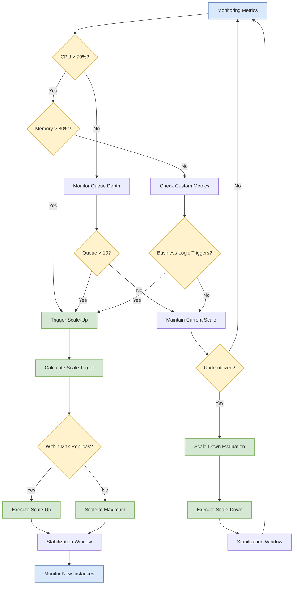

# Performance Optimization and Scalability Guide

## 1. Performance Architecture Overview

### 1.1 Performance Targets and SLAs

| Service | Response Time (P95) | Throughput | Availability | Recovery Time |
|---------|-------------------|------------|--------------|---------------|
| **User Management** | <100ms | 5,000 RPS | 99.9% | <5 minutes |
| **Account Management** | <50ms | 10,000 RPS | 99.95% | <3 minutes |
| **Transaction Processing** | <200ms | 15,000 TPS | 99.99% | <2 minutes |
| **Payment Gateway** | <500ms | 5,000 TPS | 99.9% | <5 minutes |
| **Notification Service** | <1000ms | 20,000 MPS | 99.5% | <10 minutes |

### 1.2 Scalability Architecture

```mermaid
graph TB
    subgraph "Global Infrastructure"
        SLB[Global Load Balancer<br/>Alibaba Cloud SLB<br/>- Traffic Distribution<br/>- Health Checks<br/>- SSL Termination]
    end
    
    subgraph "Multi-Region Deployment"
        subgraph "Region 1 - Primary (Asia Pacific)"
            subgraph "API Gateway Layer"
                GW1[API Gateway Cluster<br/>3 Active Instances<br/>- Rate Limiting: 10,000 RPS<br/>- Circuit Breaker Enabled<br/>- Request Routing]
            end
            
            subgraph "Microservices Cluster - Primary"
                subgraph "User Management Service"
                    U1[User Service Pod 1<br/>2 CPU - 4GB RAM]
                    U2[User Service Pod 2<br/>2 CPU - 4GB RAM]
                    U3[User Service Pod 3<br/>2 CPU - 4GB RAM]
                end
                
                subgraph "Account Management Service"
                    A1[Account Service Pod 1<br/>4 CPU - 8GB RAM]
                    A2[Account Service Pod 2<br/>4 CPU - 8GB RAM]
                    A3[Account Service Pod 3<br/>4 CPU - 8GB RAM]
                    A4[Account Service Pod 4<br/>4 CPU - 8GB RAM]
                    A5[Account Service Pod 5<br/>4 CPU - 8GB RAM]
                end
                
                subgraph "Transaction Processing Service"
                    T1[Transaction Pod 1<br/>8 CPU - 16GB RAM]
                    T2[Transaction Pod 2<br/>8 CPU - 16GB RAM]
                    T3[Transaction Pod 3<br/>8 CPU - 16GB RAM]
                    T4[Transaction Pod 4<br/>8 CPU - 16GB RAM]
                    T5[Transaction Pod 5<br/>8 CPU - 16GB RAM]
                    T6[Transaction Pod 6<br/>8 CPU - 16GB RAM]
                    T7[Transaction Pod 7<br/>8 CPU - 16GB RAM]
                    T8[Transaction Pod 8<br/>8 CPU - 16GB RAM]
                end
                
                subgraph "Supporting Services"
                    P1[Payment Service<br/>2 Pods - 4 CPU each]
                    N1[Notification Service<br/>3 Pods - 2 CPU each]
                    C1[Compliance Service<br/>2 Pods - 4 CPU each]
                end
            end
            
            subgraph "Database Cluster - Primary"
                DB1[(User Database<br/>MySQL RDS Master<br/>16 CPU - 64GB RAM<br/>1TB SSD)]
                DB2[(Account Database<br/>MySQL RDS Master<br/>32 CPU - 128GB RAM<br/>2TB SSD)]
                DB3[(Transaction Database<br/>MySQL RDS Master<br/>64 CPU - 256GB RAM<br/>4TB SSD)]
            end
        end
        
        subgraph "Region 2 - Disaster Recovery (Europe)"
            subgraph "Standby API Gateway"
                GW2[API Gateway Standby<br/>1 Instance<br/>- Passive Mode<br/>- Auto-failover Ready]
            end
            
            subgraph "Standby Microservices"
                US[User Service<br/>1-2 Pods Standby]
                AS[Account Service<br/>1-2 Pods Standby]
                TS[Transaction Service<br/>2-3 Pods Standby]
                PS[Payment Service<br/>1 Pod Standby]
                NS[Notification Service<br/>1 Pod Standby]
                CS[Compliance Service<br/>1 Pod Standby]
            end
            
            subgraph "Database Replicas"
                DR1[(User DB Replica<br/>Read-Only<br/>8 CPU - 32GB RAM)]
                DR2[(Account DB Replica<br/>Read-Only<br/>16 CPU - 64GB RAM)]
                DR3[(Transaction DB Replica<br/>Read-Only<br/>32 CPU - 128GB RAM)]
            end
        end
    end
    
    subgraph "Caching & CDN Layer"
        subgraph "Distributed Caching"
            RC1[Redis Cluster Primary<br/>6 Nodes - 16GB each<br/>- Session Storage<br/>- User Data Cache<br/>- Account Balance Cache]
            RC2[Redis Cluster Standby<br/>3 Nodes - 8GB each<br/>- Backup Cache<br/>- Cross-region Sync]
        end
        
        subgraph "Content Delivery Network"
            CDN[Global CDN<br/>Alibaba Cloud CDN<br/>- Static Assets<br/>- API Responses<br/>- Geographic Distribution]
        end
        
        subgraph "Application-Level Cache"
            LC[In-Memory Cache<br/>Spring Cache<br/>- Service-level Caching<br/>- Method Result Cache<br/>- Configuration Cache]
        end
    end
    
    subgraph "Auto-Scaling Configuration"
        HPA[Horizontal Pod Autoscaler<br/>- CPU Threshold: 70%<br/>- Memory Threshold: 80%<br/>- Min Replicas: 2<br/>- Max Replicas: 20<br/>- Scale-up: 30s<br/>- Scale-down: 5min]
        VPA[Vertical Pod Autoscaler<br/>- Resource Optimization<br/>- Right-sizing Pods<br/>- Memory/CPU Recommendations]
        CA[Cluster Autoscaler<br/>- Node Pool Management<br/>- Cost Optimization<br/>- Multi-AZ Scaling]
    end
    
    subgraph "Message Queue Layer"
        MQ[Message Queue<br/>Alibaba Cloud MQ<br/>- Event Streaming<br/>- Async Processing<br/>- Dead Letter Queue]
    end
    
    %% Load Balancer Connections
    SLB --> GW1
    SLB --> GW2
    
    %% API Gateway to Microservices
    GW1 --> U1
    GW1 --> U2
    GW1 --> U3
    GW1 --> A1
    GW1 --> A2
    GW1 --> A3
    GW1 --> A4
    GW1 --> A5
    GW1 --> T1
    GW1 --> T2
    GW1 --> T3
    GW1 --> T4
    GW1 --> T5
    GW1 --> T6
    GW1 --> T7
    GW1 --> T8
    GW1 --> P1
    GW1 --> N1
    GW1 --> C1
    
    %% Standby Gateway Connections
    GW2 --> US
    GW2 --> AS
    GW2 --> TS
    GW2 --> PS
    GW2 --> NS
    GW2 --> CS
    
    %% Database Connections - Primary
    U1 --> DB1
    U2 --> DB1
    U3 --> DB1
    A1 --> DB2
    A2 --> DB2
    A3 --> DB2
    A4 --> DB2
    A5 --> DB2
    T1 --> DB3
    T2 --> DB3
    T3 --> DB3
    T4 --> DB3
    T5 --> DB3
    T6 --> DB3
    T7 --> DB3
    T8 --> DB3
    P1 --> DB2
    C1 --> DB3
    
    %% Database Connections - DR
    US --> DR1
    AS --> DR2
    TS --> DR3
    PS --> DR2
    CS --> DR3
    
    %% Database Replication
    DB1 -.->|Async Replication<br/>< 5s Lag| DR1
    DB2 -.->|Async Replication<br/>< 5s Lag| DR2
    DB3 -.->|Async Replication<br/>< 5s Lag| DR3
    
    %% Cache Connections
    U1 --> RC1
    U2 --> RC1
    U3 --> RC1
    A1 --> RC1
    A2 --> RC1
    A3 --> RC1
    T1 --> RC1
    T2 --> RC1
    T3 --> RC1
    P1 --> RC1
    
    %% Cache Synchronization
    RC1 -.->|Cross-region Sync<br/>Real-time| RC2
    
    %% CDN Connections
    CDN -.->|Static Content| GW1
    CDN -.->|API Response Cache| GW1
    
    %% Local Cache Connections
    U1 -.-> LC
    A1 -.-> LC
    T1 -.-> LC
    
    %% Message Queue Connections
    T1 --> MQ
    T2 --> MQ
    P1 --> MQ
    N1 --> MQ
    C1 --> MQ
    
    MQ --> N1
    MQ --> C1
    
    %% Auto-scaling Monitoring
    HPA -.->|Monitors & Scales| U1
    HPA -.->|Monitors & Scales| U2
    HPA -.->|Monitors & Scales| U3
    HPA -.->|Monitors & Scales| A1
    HPA -.->|Monitors & Scales| A2
    HPA -.->|Monitors & Scales| A3
    HPA -.->|Monitors & Scales| T1
    HPA -.->|Monitors & Scales| T2
    HPA -.->|Monitors & Scales| T3
    HPA -.->|Monitors & Scales| P1
    HPA -.->|Monitors & Scales| N1
    HPA -.->|Monitors & Scales| C1
    
    VPA -.->|Optimizes Resources| U1
    VPA -.->|Optimizes Resources| A1
    VPA -.->|Optimizes Resources| T1
    
    CA -.->|Manages Cluster| HPA
    CA -.->|Node Scaling| GW1
    
    %% Styling
    classDef infrastructure fill:#e3f2fd,stroke:#1976d2,stroke-width:2px
    classDef microservice fill:#f3e5f5,stroke:#7b1fa2,stroke-width:2px
    classDef database fill:#e8f5e8,stroke:#2e7d32,stroke-width:2px
    classDef cache fill:#fff3e0,stroke:#ef6c00,stroke-width:2px
    classDef autoscale fill:#fce4ec,stroke:#c2185b,stroke-width:2px
    classDef messaging fill:#f1f8e9,stroke:#689f38,stroke-width:2px
    classDef standby fill:#f5f5f5,stroke:#616161,stroke-width:2px,stroke-dasharray: 5 5
    
    class SLB,GW1,GW2,CDN infrastructure
    class U1,U2,U3,A1,A2,A3,A4,A5,T1,T2,T3,T4,T5,T6,T7,T8,P1,N1,C1 microservice
    class US,AS,TS,PS,NS,CS standby
    class DB1,DB2,DB3,DR1,DR2,DR3 database
    class RC1,RC2,LC cache
    class HPA,VPA,CA autoscale
    class MQ messaging
```



#### Scalability Metrics and Performance Targets

| Component | Current Capacity | Target Capacity | Scaling Method | Recovery Time |
|-----------|------------------|-----------------|----------------|---------------|
| **API Gateway** | 5,000 RPS | 50,000 RPS | Horizontal + Load Balancing | < 30 seconds |
| **User Management** | 2,000 RPS | 10,000 RPS | Horizontal Pod Autoscaling | < 60 seconds |
| **Account Management** | 5,000 RPS | 25,000 RPS | Horizontal Pod Autoscaling | < 45 seconds |
| **Transaction Processing** | 1,000 TPS | 15,000 TPS | Horizontal + Vertical Scaling | < 30 seconds |
| **Database Layer** | 5,000 QPS | 50,000 QPS | Read Replicas + Sharding | < 2 minutes |
| **Cache Layer** | 10,000 ops/sec | 100,000 ops/sec | Redis Cluster Scaling | < 15 seconds |

#### Auto-Scaling Policies

The eWallet platform implements comprehensive auto-scaling policies to ensure optimal performance and cost efficiency across all microservices.

**Horizontal Pod Autoscaler (HPA) Configuration:**

```yaml
# Transaction Service HPA - High Priority
apiVersion: autoscaling/v2
kind: HorizontalPodAutoscaler
metadata:
  name: transaction-service-hpa
  namespace: ewallet-production
spec:
  scaleTargetRef:
    apiVersion: apps/v1
    kind: Deployment
    name: transaction-service
  minReplicas: 3
  maxReplicas: 20
  metrics:
  - type: Resource
    resource:
      name: cpu
      target:
        type: Utilization
        averageUtilization: 70
  - type: Resource
    resource:
      name: memory
      target:
        type: Utilization
        averageUtilization: 80
  - type: Pods
    pods:
      metric:
        name: transaction_queue_depth
      target:
        type: AverageValue
        averageValue: "10"
  behavior:
    scaleUp:
      stabilizationWindowSeconds: 30
      policies:
      - type: Percent
        value: 50
        periodSeconds: 30
      - type: Pods
        value: 5
        periodSeconds: 30
      selectPolicy: Max
    scaleDown:
      stabilizationWindowSeconds: 300
      policies:
      - type: Percent
        value: 10
        periodSeconds: 60
      selectPolicy: Min
---
# Account Service HPA - Medium Priority
apiVersion: autoscaling/v2
kind: HorizontalPodAutoscaler
metadata:
  name: account-service-hpa
  namespace: ewallet-production
spec:
  scaleTargetRef:
    apiVersion: apps/v1
    kind: Deployment
    name: account-service
  minReplicas: 2
  maxReplicas: 15
  metrics:
  - type: Resource
    resource:
      name: cpu
      target:
        type: Utilization
        averageUtilization: 75
  - type: Resource
    resource:
      name: memory
      target:
        type: Utilization
        averageUtilization: 85
  behavior:
    scaleUp:
      stabilizationWindowSeconds: 45
      policies:
      - type: Percent
        value: 30
        periodSeconds: 45
    scaleDown:
      stabilizationWindowSeconds: 300
      policies:
      - type: Percent
        value: 15
        periodSeconds: 90
---
# User Service HPA - Standard Priority
apiVersion: autoscaling/v2
kind: HorizontalPodAutoscaler
metadata:
  name: user-service-hpa
  namespace: ewallet-production
spec:
  scaleTargetRef:
    apiVersion: apps/v1
    kind: Deployment
    name: user-service
  minReplicas: 2
  maxReplicas: 10
  metrics:
  - type: Resource
    resource:
      name: cpu
      target:
        type: Utilization
        averageUtilization: 80
  - type: Resource
    resource:
      name: memory
      target:
        type: Utilization
        averageUtilization: 85
  behavior:
    scaleUp:
      stabilizationWindowSeconds: 60
      policies:
      - type: Percent
        value: 25
        periodSeconds: 60
    scaleDown:
      stabilizationWindowSeconds: 300
      policies:
      - type: Percent
        value: 20
        periodSeconds: 120
```

**Vertical Pod Autoscaler (VPA) Configuration:**

```yaml
# VPA for Resource Optimization
apiVersion: autoscaling.k8s.io/v1
kind: VerticalPodAutoscaler
metadata:
  name: transaction-service-vpa
  namespace: ewallet-production
spec:
  targetRef:
    apiVersion: apps/v1
    kind: Deployment
    name: transaction-service
  updatePolicy:
    updateMode: "Auto"
  resourcePolicy:
    containerPolicies:
    - containerName: transaction-service
      minAllowed:
        cpu: 100m
        memory: 128Mi
      maxAllowed:
        cpu: 8
        memory: 16Gi
      controlledResources: ["cpu", "memory"]
```

**Cluster Autoscaler Configuration:**

```yaml
# Cluster Autoscaler for Node Management
apiVersion: v1
kind: ConfigMap
metadata:
  name: cluster-autoscaler-status
  namespace: kube-system
data:
  nodes.max: "100"
  nodes.min: "5"
  scale-down-delay-after-add: "10m"
  scale-down-unneeded-time: "10m"
  scale-down-utilization-threshold: "0.5"
  skip-nodes-with-local-storage: "false"
  skip-nodes-with-system-pods: "true"
```

**Auto-Scaling Decision Flow:**



**Scaling Policies Summary:**

| Service | Min Replicas | Max Replicas | CPU Threshold | Memory Threshold | Scale-Up Time | Scale-Down Time |
|---------|--------------|--------------|---------------|------------------|---------------|-----------------|
| **Transaction Service** | 3 | 20 | 70% | 80% | 30s | 5min |
| **Account Service** | 2 | 15 | 75% | 85% | 45s | 5min |
| **User Service** | 2 | 10 | 80% | 85% | 60s | 5min |
| **Payment Service** | 2 | 8 | 75% | 80% | 60s | 10min |
| **Notification Service** | 1 | 12 | 80% | 85% | 90s | 10min |

**Cost Optimization Strategies:**

- **Predictive Scaling**: Pre-scale during known peak hours (9 AM - 6 PM)
- **Scheduled Scaling**: Reduce replicas during low-traffic periods (11 PM - 6 AM)
- **Spot Instance Integration**: Use spot instances for non-critical workloads
- **Resource Right-sizing**: VPA recommendations applied weekly
- **Multi-zone Distribution**: Ensure cost-effective geographic distribution
## 2. Database Performance Optimization

### 2.1 Database Connection Pooling and Optimization

**HikariCP Configuration for High Performance:**

```java
@Configuration
@EnableJpaRepositories
@EnableTransactionManagement
public class DatabaseConfiguration {
    
    @Bean
    @Primary
    @ConfigurationProperties("spring.datasource.master.hikari")
    public HikariConfig masterHikariConfig() {
        HikariConfig config = new HikariConfig();
        
        // Connection pool settings for high performance
        config.setMaximumPoolSize(50);
        config.setMinimumIdle(10);
        config.setConnectionTimeout(30000);  // 30 seconds
        config.setIdleTimeout(600000);       // 10 minutes
        config.setMaxLifetime(1800000);      // 30 minutes
        config.setLeakDetectionThreshold(60000); // 1 minute
        config.setValidationTimeout(3000);   // 3 seconds
        
        // MySQL specific performance optimizations
        config.addDataSourceProperty("cachePrepStmts", "true");
        config.addDataSourceProperty("prepStmtCacheSize", "250");
        config.addDataSourceProperty("prepStmtCacheSqlLimit", "2048");
        config.addDataSourceProperty("useServerPrepStmts", "true");
        config.addDataSourceProperty("useLocalSessionState", "true");
        config.addDataSourceProperty("rewriteBatchedStatements", "true");
        config.addDataSourceProperty("cacheResultSetMetadata", "true");
        config.addDataSourceProperty("cacheServerConfiguration", "true");
        config.addDataSourceProperty("elideSetAutoCommits", "true");
        config.addDataSourceProperty("maintainTimeStats", "false");
        config.addDataSourceProperty("tcpKeepAlive", "true");
        config.addDataSourceProperty("tcpNoDelay", "true");
        
        return config;
    }
    
    @Bean
    @ConfigurationProperties("spring.datasource.slave.hikari")
    public HikariConfig slaveHikariConfig() {
        HikariConfig config = new HikariConfig();
        
        // Read replica optimized settings
        config.setMaximumPoolSize(30);
        config.setMinimumIdle(5);
        config.setConnectionTimeout(30000);
        config.setIdleTimeout(600000);
        config.setMaxLifetime(1800000);
        config.setReadOnly(true);
        
        // Same MySQL optimizations as master
        config.addDataSourceProperty("cachePrepStmts", "true");
        config.addDataSourceProperty("prepStmtCacheSize", "250");
        config.addDataSourceProperty("prepStmtCacheSqlLimit", "2048");
        config.addDataSourceProperty("useServerPrepStmts", "true");
        config.addDataSourceProperty("useLocalSessionState", "true");
        config.addDataSourceProperty("cacheResultSetMetadata", "true");
        config.addDataSourceProperty("cacheServerConfiguration", "true");
        
        return config;
    }
    
    @Bean(name = "masterDataSource")
    @Primary
    public DataSource masterDataSource(@Qualifier("masterHikariConfig") HikariConfig hikariConfig) {
        return new HikariDataSource(hikariConfig);
    }
    
    @Bean(name = "slaveDataSource")
    public DataSource slaveDataSource(@Qualifier("slaveHikariConfig") HikariConfig hikariConfig) {
        return new HikariDataSource(hikariConfig);
    }
    
    @Bean
    public PlatformTransactionManager transactionManager(EntityManagerFactory entityManagerFactory) {
        JpaTransactionManager transactionManager = new JpaTransactionManager();
        transactionManager.setEntityManagerFactory(entityManagerFactory);
        return transactionManager;
    }
}

/**
 * Database query optimization repository
 */
@Repository
@Transactional
public class OptimizedTransactionRepository {
    
    @PersistenceContext
    private EntityManager entityManager;
    
    @Autowired
    private RedisTemplate<String, Object> redisTemplate;
    
    private static final String TRANSACTION_CACHE_KEY = "transaction:";
    private static final String USER_TRANSACTIONS_CACHE_KEY = "user-transactions:";
    
    /**
     * Optimized query with pagination and caching for user transactions
     */
    @Cacheable(value = "user-transactions", key = "#userId + '-' + #page + '-' + #size")
    @Transactional(readOnly = true)
    public Page<Transaction> findUserTransactions(String userId, int page, int size) {
        
        // Optimized JPQL with explicit fetch joins to avoid N+1 queries
        String jpql = """
            SELECT DISTINCT t FROM Transaction t 
            LEFT JOIN FETCH t.sourceAccount sa
            LEFT JOIN FETCH t.targetAccount ta
            WHERE (sa.userId = :userId OR ta.userId = :userId)
            AND t.status IN ('COMPLETED', 'PENDING', 'PROCESSING')
            ORDER BY t.createdAt DESC
            """;
        
        TypedQuery<Transaction> query = entityManager.createQuery(jpql, Transaction.class);
        query.setParameter("userId", userId);
        query.setFirstResult(page * size);
        query.setMaxResults(size);
        query.setHint(QueryHints.HINT_CACHEABLE, true);
        
        List<Transaction> transactions = query.getResultList();
        
        // Efficient count query using subquery
        String countJpql = """
            SELECT COUNT(DISTINCT t.id) FROM Transaction t 
            JOIN t.sourceAccount sa ON sa.userId = :userId
            OR JOIN t.targetAccount ta ON ta.userId = :userId
            WHERE t.status IN ('COMPLETED', 'PENDING', 'PROCESSING')
            """;
        
        TypedQuery<Long> countQuery = entityManager.createQuery(countJpql, Long.class);
        countQuery.setParameter("userId", userId);
        countQuery.setHint(QueryHints.HINT_CACHEABLE, true);
        Long total = countQuery.getSingleResult();
        
        return new PageImpl<>(transactions, PageRequest.of(page, size), total);
    }
    
    /**
     * Batch operations for better performance using JDBC batch
     */
    @Transactional
    public void batchUpdateTransactionStatus(List<String> transactionIds, TransactionStatus status) {
        
        if (transactionIds.isEmpty()) {
            return;
        }
        
        // Use native query for better performance on large batches
        String nativeQuery = """
            UPDATE transactions 
            SET status = :status, updated_at = :updatedAt 
            WHERE id IN (:transactionIds)
            """;
        
        Query query = entityManager.createNativeQuery(nativeQuery);
        query.setParameter("status", status.name());
        query.setParameter("updatedAt", LocalDateTime.now());
        query.setParameter("transactionIds", transactionIds);
        
        int updatedCount = query.executeUpdate();
        
        // Clear cache for affected transactions
        transactionIds.forEach(id -> {
            redisTemplate.delete(TRANSACTION_CACHE_KEY + id);
        });
        
        // Also clear user transaction caches that might be affected
        redisTemplate.delete(redisTemplate.keys(USER_TRANSACTIONS_CACHE_KEY + "*"));
        
        log.info("Batch updated {} transaction statuses to {}", updatedCount, status);
    }
    
    /**
     * Optimized balance calculation with improved performance
     */
    @Query(value = """
        SELECT 
            a.id as account_id,
            a.account_number,
            a.available_balance,
            a.reserved_balance,
            COALESCE(credit_sum.total_credits, 0) as total_credits,
            COALESCE(debit_sum.total_debits, 0) as total_debits,
            (a.available_balance + COALESCE(credit_sum.total_credits, 0) - COALESCE(debit_sum.total_debits, 0)) as calculated_balance
        FROM accounts a
        LEFT JOIN (
            SELECT 
                target_account_id,
                SUM(amount) as total_credits
            FROM transactions 
            WHERE status = 'COMPLETED' 
            AND created_at >= :fromDate
            GROUP BY target_account_id
        ) credit_sum ON credit_sum.target_account_id = a.id
        LEFT JOIN (
            SELECT 
                source_account_id,
                SUM(amount) as total_debits
            FROM transactions 
            WHERE status = 'COMPLETED' 
            AND created_at >= :fromDate
            GROUP BY source_account_id
        ) debit_sum ON debit_sum.source_account_id = a.id
        WHERE a.user_id = :userId
        AND a.status = 'ACTIVE'
        """, nativeQuery = true)
    List<Object[]> calculateUserBalanceSummary(@Param("userId") String userId, 
                                             @Param("fromDate") LocalDateTime fromDate);
    
    /**
     * High-performance transaction search with multiple filters
     */
    @Transactional(readOnly = true)
    public Page<Transaction> searchTransactions(TransactionSearchCriteria criteria, Pageable pageable) {
        
        CriteriaBuilder cb = entityManager.getCriteriaBuilder();
        CriteriaQuery<Transaction> query = cb.createQuery(Transaction.class);
        Root<Transaction> root = query.from(Transaction.class);
        
        // Build dynamic predicates
        List<Predicate> predicates = new ArrayList<>();
        
        if (criteria.getUserId() != null) {
            predicates.add(cb.or(
                cb.equal(root.get("sourceAccount").get("userId"), criteria.getUserId()),
                cb.equal(root.get("targetAccount").get("userId"), criteria.getUserId())
            ));
        }
        
        if (criteria.getTransactionType() != null) {
            predicates.add(cb.equal(root.get("transactionType"), criteria.getTransactionType()));
        }
        
        if (criteria.getStatus() != null) {
            predicates.add(cb.equal(root.get("status"), criteria.getStatus()));
        }
        
        if (criteria.getFromDate() != null) {
            predicates.add(cb.greaterThanOrEqualTo(root.get("createdAt"), criteria.getFromDate()));
        }
        
        if (criteria.getToDate() != null) {
            predicates.add(cb.lessThanOrEqualTo(root.get("createdAt"), criteria.getToDate()));
        }
        
        if (criteria.getMinAmount() != null) {
            predicates.add(cb.greaterThanOrEqualTo(root.get("amount"), criteria.getMinAmount()));
        }
        
        if (criteria.getMaxAmount() != null) {
            predicates.add(cb.lessThanOrEqualTo(root.get("amount"), criteria.getMaxAmount()));
        }
        
        query.where(predicates.toArray(new Predicate[0]));
        query.orderBy(cb.desc(root.get("createdAt")));
        
        TypedQuery<Transaction> typedQuery = entityManager.createQuery(query);
        typedQuery.setFirstResult((int) pageable.getOffset());
        typedQuery.setMaxResults(pageable.getPageSize());
        
        List<Transaction> transactions = typedQuery.getResultList();
        
        // Count query for pagination
        CriteriaQuery<Long> countQuery = cb.createQuery(Long.class);
        Root<Transaction> countRoot = countQuery.from(Transaction.class);
        countQuery.select(cb.count(countRoot));
        countQuery.where(predicates.toArray(new Predicate[0]));
        
        Long total = entityManager.createQuery(countQuery).getSingleResult();
        
        return new PageImpl<>(transactions, pageable, total);
    }
    
    /**
     * Bulk insert optimization for transaction events
     */
    @Transactional
    public void bulkInsertTransactionEvents(List<TransactionEvent> events) {
        
        final int batchSize = 100;
        
        for (int i = 0; i < events.size(); i++) {
            entityManager.persist(events.get(i));
            
            if (i % batchSize == 0 && i > 0) {
                // Flush and clear the persistence context
                entityManager.flush();
                entityManager.clear();
            }
        }
        
        // Final flush for remaining entities
        entityManager.flush();
        entityManager.clear();
    }
}

/**
 * Transaction search criteria for dynamic queries
 */
@Data
@Builder
@NoArgsConstructor
@AllArgsConstructor
public class TransactionSearchCriteria {
    private String userId;
    private TransactionType transactionType;
    private TransactionStatus status;
    private LocalDateTime fromDate;
    private LocalDateTime toDate;
    private BigDecimal minAmount;
    private BigDecimal maxAmount;
    private String referenceId;
    private List<String> accountIds;
}
```

### 2.2 Database Indexing Strategy

```sql
-- Performance-optimized indexes for high-volume queries

-- User Management Service Indexes
CREATE INDEX CONCURRENTLY idx_users_email_hash ON users USING hash(email);
CREATE INDEX CONCURRENTLY idx_users_status_created ON users(status, created_at);
CREATE INDEX CONCURRENTLY idx_users_kyc_status_updated ON users(kyc_status, updated_at);
CREATE INDEX CONCURRENTLY idx_user_sessions_token_hash ON user_sessions USING hash(session_token);
CREATE INDEX CONCURRENTLY idx_user_sessions_expires ON user_sessions(expires_at) WHERE is_active = true;

-- Account Management Service Indexes
CREATE INDEX CONCURRENTLY idx_accounts_user_status ON accounts(user_id, status) INCLUDE (available_balance);
CREATE INDEX CONCURRENTLY idx_accounts_number_hash ON accounts USING hash(account_number);
CREATE INDEX CONCURRENTLY idx_balance_history_account_date ON account_balance_history(account_id, created_at DESC);
CREATE INDEX CONCURRENTLY idx_balance_history_transaction ON account_balance_history(transaction_id);

-- Transaction Processing Service Indexes (Partitioned)
CREATE INDEX CONCURRENTLY idx_transactions_source_date ON transactions(source_account_id, created_at DESC);
CREATE INDEX CONCURRENTLY idx_transactions_target_date ON transactions(target_account_id, created_at DESC);
CREATE INDEX CONCURRENTLY idx_transactions_status_type ON transactions(status, transaction_type);
CREATE INDEX CONCURRENTLY idx_transactions_amount_range ON transactions(amount) WHERE amount >= 1000;
CREATE INDEX CONCURRENTLY idx_transactions_reference ON transactions(reference_id) WHERE reference_id IS NOT NULL;

-- Composite indexes for complex queries
CREATE INDEX CONCURRENTLY idx_transactions_user_activity 
ON transactions(source_account_id, status, created_at DESC) 
INCLUDE (amount, transaction_type);

CREATE INDEX CONCURRENTLY idx_ledger_account_posting 
ON ledger_entries(account_id, posting_date DESC) 
INCLUDE (amount, entry_type, balance_after);

-- Event store indexes for event sourcing
CREATE INDEX CONCURRENTLY idx_events_aggregate_version ON transaction_events(aggregate_id, event_version);
CREATE INDEX CONCURRENTLY idx_events_type_occurred ON transaction_events(event_type, occurred_at);
CREATE INDEX CONCURRENTLY idx_events_unprocessed ON transaction_events(processed, occurred_at) WHERE processed = false;
```

### 2.3 Read Replica and Query Optimization

**Database Read Replica Configuration:**

```yaml
# Application.yml - Database Configuration
spring:
  datasource:
    master:
      driver-class-name: com.mysql.cj.jdbc.Driver
      url: jdbc:mysql://rds-master.region.rds.aliyuncs.com:3306/ewallet_db?useSSL=true&serverTimezone=UTC&characterEncoding=utf8&useUnicode=true
      username: ${DB_MASTER_USERNAME}
      password: ${DB_MASTER_PASSWORD}
      hikari:
        maximum-pool-size: 50
        minimum-idle: 10
        connection-timeout: 30000
        idle-timeout: 600000
        max-lifetime: 1800000
        leak-detection-threshold: 60000
        
    slave:
      driver-class-name: com.mysql.cj.jdbc.Driver
      url: jdbc:mysql://rds-slave.region.rds.aliyuncs.com:3306/ewallet_db?useSSL=true&serverTimezone=UTC&characterEncoding=utf8&useUnicode=true
      username: ${DB_SLAVE_USERNAME}
      password: ${DB_SLAVE_PASSWORD}
      hikari:
        maximum-pool-size: 30
        minimum-idle: 5
        connection-timeout: 30000
        idle-timeout: 600000
        max-lifetime: 1800000
        read-only: true

  jpa:
    hibernate:
      ddl-auto: validate
    properties:
      hibernate:
        dialect: org.hibernate.dialect.MySQL8Dialect
        show_sql: false
        format_sql: true
        use_sql_comments: true
        jdbc:
          batch_size: 100
          batch_versioned_data: true
        order_inserts: true
        order_updates: true
        generate_statistics: false
        cache:
          use_second_level_cache: true
          use_query_cache: true
          region:
            factory_class: org.hibernate.cache.jcache.JCacheRegionFactory
```

**Database Routing Configuration:**

```java
@Configuration
@EnableConfigurationProperties
public class DatabaseRoutingConfiguration {
    
    @Bean
    @ConfigurationProperties("spring.datasource.master")
    public DataSourceProperties masterDataSourceProperties() {
        return new DataSourceProperties();
    }
    
    @Bean
    @ConfigurationProperties("spring.datasource.slave")
    public DataSourceProperties slaveDataSourceProperties() {
        return new DataSourceProperties();
    }
    
    @Bean(name = "masterDataSource")
    @Primary
    public DataSource masterDataSource() {
        return masterDataSourceProperties()
                .initializeDataSourceBuilder()
                .type(HikariDataSource.class)
                .build();
    }
    
    @Bean(name = "slaveDataSource")
    public DataSource slaveDataSource() {
        return slaveDataSourceProperties()
                .initializeDataSourceBuilder()
                .type(HikariDataSource.class)
                .build();
    }
    
    @Bean
    @Primary
    public DataSource routingDataSource(
            @Qualifier("masterDataSource") DataSource masterDataSource,
            @Qualifier("slaveDataSource") DataSource slaveDataSource) {
        
        RoutingDataSource routingDataSource = new RoutingDataSource();
        
        Map<Object, Object> targetDataSources = new HashMap<>();
        targetDataSources.put(DatabaseType.MASTER, masterDataSource);
        targetDataSources.put(DatabaseType.SLAVE, slaveDataSource);
        
        routingDataSource.setTargetDataSources(targetDataSources);
        routingDataSource.setDefaultTargetDataSource(masterDataSource);
        
        return routingDataSource;
    }
    
    @Bean
    public LocalContainerEntityManagerFactoryBean entityManagerFactory(
            @Qualifier("routingDataSource") DataSource dataSource) {
        
        LocalContainerEntityManagerFactoryBean em = new LocalContainerEntityManagerFactoryBean();
        em.setDataSource(dataSource);
        em.setPackagesToScan("com.globalpay.ewallet.entity");
        
        HibernateJpaVendorAdapter vendorAdapter = new HibernateJpaVendorAdapter();
        vendorAdapter.setShowSql(false);
        vendorAdapter.setGenerateDdl(false);
        vendorAdapter.setDatabase(Database.MYSQL);
        em.setJpaVendorAdapter(vendorAdapter);
        
        return em;
    }
}

/**
 * Custom routing data source that determines which database to use
 */
public class RoutingDataSource extends AbstractRoutingDataSource {
    
    @Override
    protected Object determineCurrentLookupKey() {
        return DatabaseContextHolder.getDatabaseType();
    }
}

/**
 * Thread-local storage for database routing
 */
public class DatabaseContextHolder {
    
    private static final ThreadLocal<DatabaseType> contextHolder = new ThreadLocal<>();
    
    public static void setDatabaseType(DatabaseType databaseType) {
        contextHolder.set(databaseType);
    }
    
    public static DatabaseType getDatabaseType() {
        return contextHolder.get();
    }
    
    public static void clearDatabaseType() {
        contextHolder.remove();
    }
}

/**
 * Database type enumeration
 */
public enum DatabaseType {
    MASTER, SLAVE
}

/**
 * Annotations for read-only operations
 */
@Target({ElementType.METHOD, ElementType.TYPE})
@Retention(RetentionPolicy.RUNTIME)
@Transactional(readOnly = true)
public @interface ReadOnlyRepository {
}

@Target({ElementType.METHOD, ElementType.TYPE})
@Retention(RetentionPolicy.RUNTIME)
@Transactional(readOnly = false)
public @interface WriteRepository {
}

/**
 * AOP aspect for database routing
 */
@Aspect
@Component
@Order(1)
public class DatabaseRoutingAspect {
    
    @Before("@annotation(ReadOnlyRepository)")
    public void setReadDataSource() {
        DatabaseContextHolder.setDatabaseType(DatabaseType.SLAVE);
    }
    
    @Before("@annotation(WriteRepository)")
    public void setWriteDataSource() {
        DatabaseContextHolder.setDatabaseType(DatabaseType.MASTER);
    }
    
    @After("@annotation(ReadOnlyRepository) || @annotation(WriteRepository)")
    public void clearDataSource() {
        DatabaseContextHolder.clearDatabaseType();
    }
}
```

### 2.4 Database Performance Monitoring and Metrics

**Performance Monitoring Configuration:**

```java
@Component
@ConditionalOnProperty(name = "database.monitoring.enabled", havingValue = "true")
public class DatabasePerformanceMonitor {
    
    private final MeterRegistry meterRegistry;
    private final DataSource dataSource;
    private final Timer queryTimer;
    private final Counter slowQueryCounter;
    private final Gauge activeConnectionsGauge;
    
    public DatabasePerformanceMonitor(MeterRegistry meterRegistry, DataSource dataSource) {
        this.meterRegistry = meterRegistry;
        this.dataSource = dataSource;
        
        this.queryTimer = Timer.builder("database.query.execution.time")
                .description("Database query execution time")
                .register(meterRegistry);
                
        this.slowQueryCounter = Counter.builder("database.slow.queries.total")
                .description("Total number of slow queries")
                .register(meterRegistry);
                
        this.activeConnectionsGauge = Gauge.builder("database.connections.active")
                .description("Active database connections")
                .register(meterRegistry, this, DatabasePerformanceMonitor::getActiveConnections);
    }
    
    public void recordQueryExecution(String queryType, Duration duration) {
        queryTimer.record(duration, Tags.of("query.type", queryType));
        
        // Consider queries over 1 second as slow
        if (duration.toMillis() > 1000) {
            slowQueryCounter.increment(Tags.of("query.type", queryType));
        }
    }
    
    private double getActiveConnections() {
        if (dataSource instanceof HikariDataSource hikariDataSource) {
            return hikariDataSource.getHikariPoolMXBean().getActiveConnections();
        }
        return 0;
    }
    
    @EventListener
    @Async
    public void handleSlowQuery(SlowQueryEvent event) {
        log.warn("Slow query detected: {} took {}ms", 
                event.getQuery(), event.getDuration().toMillis());
        
        // Send alert if query is extremely slow (> 5 seconds)
        if (event.getDuration().toSeconds() > 5) {
            // Send alert to monitoring system
            alertService.sendSlowQueryAlert(event);
        }
    }
}

/**
 * AOP aspect for database query monitoring
 */
@Aspect
@Component
@ConditionalOnProperty(name = "database.monitoring.enabled", havingValue = "true")
public class DatabaseQueryMonitoringAspect {
    
    @Autowired
    private DatabasePerformanceMonitor performanceMonitor;
    
    @Around("execution(* javax.persistence.EntityManager.createQuery(..))")
    public Object monitorJpqlQuery(ProceedingJoinPoint joinPoint) throws Throwable {
        return monitorQuery(joinPoint, "JPQL");
    }
    
    @Around("execution(* javax.persistence.EntityManager.createNativeQuery(..))")
    public Object monitorNativeQuery(ProceedingJoinPoint joinPoint) throws Throwable {
        return monitorQuery(joinPoint, "NATIVE");
    }
    
    private Object monitorQuery(ProceedingJoinPoint joinPoint, String queryType) throws Throwable {
        Timer.Sample sample = Timer.start();
        
        try {
            Object result = joinPoint.proceed();
            
            Duration duration = sample.stop(Timer.builder("database.query.execution.time")
                    .tag("query.type", queryType)
                    .tag("status", "success")
                    .register(Metrics.globalRegistry));
            
            performanceMonitor.recordQueryExecution(queryType, duration);
            
            return result;
            
        } catch (Exception e) {
            sample.stop(Timer.builder("database.query.execution.time")
                    .tag("query.type", queryType)
                    .tag("status", "error")
                    .register(Metrics.globalRegistry));
            
            throw e;
        }
    }
}

/**
 * Database health check
 */
@Component
public class DatabaseHealthIndicator implements HealthIndicator {
    
    @Autowired
    private DataSource dataSource;
    
    @Override
    public Health health() {
        try (Connection connection = dataSource.getConnection()) {
            
            // Test basic connectivity
            if (connection.isValid(5)) {
                
                // Check connection pool status
                if (dataSource instanceof HikariDataSource hikariDataSource) {
                    HikariPoolMXBean poolBean = hikariDataSource.getHikariPoolMXBean();
                    
                    Map<String, Object> details = new HashMap<>();
                    details.put("active.connections", poolBean.getActiveConnections());
                    details.put("idle.connections", poolBean.getIdleConnections());
                    details.put("total.connections", poolBean.getTotalConnections());
                    details.put("threads.awaiting.connection", poolBean.getThreadsAwaitingConnection());
                    
                    // Check if pool is healthy
                    if (poolBean.getActiveConnections() < poolBean.getMaximumPoolSize() * 0.9) {
                        return Health.up()
                                .withDetails(details)
                                .build();
                    } else {
                        return Health.down()
                                .withDetail("reason", "Connection pool near capacity")
                                .withDetails(details)
                                .build();
                    }
                }
                
                return Health.up().build();
                
            } else {
                return Health.down()
                        .withDetail("reason", "Database connection validation failed")
                        .build();
            }
            
        } catch (SQLException e) {
            return Health.down()
                    .withDetail("reason", "Database connection failed")
                    .withDetail("error", e.getMessage())
                    .build();
        }
    }
}
```

### 3. Caching Strategy Implementation

### 3.1 Multi-Level Caching Architecture

```java
@Configuration
@EnableCaching
public class CacheConfiguration {
    
    @Bean
    public CacheManager cacheManager(RedisConnectionFactory connectionFactory) {
        RedisCacheConfiguration cacheConfig = RedisCacheConfiguration.defaultCacheConfig()
            .entryTtl(Duration.ofMinutes(30))
            .serializeKeysWith(RedisSerializationContext.SerializationPair
                .fromSerializer(new StringRedisSerializer()))
            .serializeValuesWith(RedisSerializationContext.SerializationPair
                .fromSerializer(new GenericJackson2JsonRedisSerializer()));
        
        Map<String, RedisCacheConfiguration> cacheConfigurations = new HashMap<>();
        
        // User cache - 1 hour TTL
        cacheConfigurations.put("users", cacheConfig.entryTtl(Duration.ofHours(1)));
        
        // Account balance cache - 5 minutes TTL
        cacheConfigurations.put("account-balances", cacheConfig.entryTtl(Duration.ofMinutes(5)));
        
        // Transaction cache - 30 minutes TTL
        cacheConfigurations.put("transactions", cacheConfig.entryTtl(Duration.ofMinutes(30)));
        
        // Session cache - 24 hours TTL
        cacheConfigurations.put("user-sessions", cacheConfig.entryTtl(Duration.ofHours(24)));
        
        // Configuration cache - 1 hour TTL
        cacheConfigurations.put("system-config", cacheConfig.entryTtl(Duration.ofHours(1)));
        
        return RedisCacheManager.builder(connectionFactory)
            .cacheDefaults(cacheConfig)
            .withInitialCacheConfigurations(cacheConfigurations)
            .build();
    }
    
    @Bean
    public RedisTemplate<String, Object> redisTemplate(RedisConnectionFactory connectionFactory) {
        RedisTemplate<String, Object> template = new RedisTemplate<>();
        template.setConnectionFactory(connectionFactory);
        
        // Use Jackson2JsonRedisSerializer for value serialization
        Jackson2JsonRedisSerializer<Object> jackson2JsonRedisSerializer = 
            new Jackson2JsonRedisSerializer<>(Object.class);
        
        ObjectMapper objectMapper = new ObjectMapper();
        objectMapper.setVisibility(PropertyAccessor.ALL, JsonAutoDetect.Visibility.ANY);
        objectMapper.activateDefaultTyping(LaissezFaireSubTypeValidator.instance, 
            ObjectMapper.DefaultTyping.NON_FINAL);
        jackson2JsonRedisSerializer.setObjectMapper(objectMapper);
        
        // Set serializers
        template.setKeySerializer(new StringRedisSerializer());
        template.setHashKeySerializer(new StringRedisSerializer());
        template.setValueSerializer(jackson2JsonRedisSerializer);
        template.setHashValueSerializer(jackson2JsonRedisSerializer);
        
        template.afterPropertiesSet();
        return template;
    }
}

@Service
public class CacheOptimizedUserService {
    
    @Autowired
    private UserRepository userRepository;
    
    @Autowired
    private AccountService accountService;
    
    @Autowired
    private UserPreferencesService userPreferencesService;
    
    @Autowired
    private RedisTemplate<String, Object> redisTemplate;
    
    private static final String USER_CACHE_PREFIX = "user:";
    private static final String USER_SESSION_PREFIX = "session:";
    
    @Cacheable(value = "users", key = "#userId")
    public User findById(String userId) {
        return userRepository.findById(userId)
            .orElseThrow(() -> new UserNotFoundException("User not found: " + userId));
    }
    
    @CacheEvict(value = "users", key = "#user.id")
    public User updateUser(User user) {
        User updatedUser = userRepository.save(user);
        
        // Also invalidate related caches
        invalidateUserRelatedCaches(user.getId());
        
        return updatedUser;
    }
    
    // Warm-up cache for frequently accessed users
    @EventListener
    public void handleUserLoginEvent(UserLoginEvent event) {
        String userId = event.getUserId();
        
        // Pre-load user data into cache
        CompletableFuture.runAsync(() -> {
            try {
                findById(userId);
                accountService.getUserAccounts(userId);
                userPreferencesService.getUserPreferences(userId);
            } catch (Exception e) {
                log.warn("Failed to warm up cache for user: {}", userId, e);
            }
        });
    }
    
    // Bulk cache operations for better performance
    public Map<String, User> findUsersByIds(List<String> userIds) {
        Map<String, User> result = new HashMap<>();
        List<String> uncachedIds = new ArrayList<>();
        
        // Check cache first
        for (String userId : userIds) {
            String cacheKey = USER_CACHE_PREFIX + userId;
            User cachedUser = (User) redisTemplate.opsForValue().get(cacheKey);
            
            if (cachedUser != null) {
                result.put(userId, cachedUser);
            } else {
                uncachedIds.add(userId);
            }
        }
        
        // Fetch uncached users from database
        if (!uncachedIds.isEmpty()) {
            List<User> dbUsers = userRepository.findByIdIn(uncachedIds);
            
            for (User user : dbUsers) {
                result.put(user.getId(), user);
                
                // Cache the user
                String cacheKey = USER_CACHE_PREFIX + user.getId();
                redisTemplate.opsForValue().set(cacheKey, user, Duration.ofHours(1));
            }
        }
        
        return result;
    }
    
    private void invalidateUserRelatedCaches(String userId) {
        Set<String> keys = redisTemplate.keys("*" + userId + "*");
        if (!keys.isEmpty()) {
            redisTemplate.delete(keys);
        }
    }
}

/**
 * Cache invalidation message for distributed cache synchronization
 */
@Data
@AllArgsConstructor
@NoArgsConstructor
public class CacheInvalidationMessage {
    private String cacheType;
    private String key;
    private long timestamp;
}

/**
 * Advanced caching service with L1 and L2 cache support
 */
@Service
public class MultiLevelCacheService {
    
    private final Map<String, Object> l1Cache = new ConcurrentHashMap<>();
    private final RedisTemplate<String, Object> l2Cache;
    private final int l1MaxSize = 1000;
    private final Duration l1Ttl = Duration.ofMinutes(5);
    
    public MultiLevelCacheService(RedisTemplate<String, Object> redisTemplate) {
        this.l2Cache = redisTemplate;
    }
    
    public <T> T get(String key, Class<T> type) {
        // Check L1 cache first
        Object cached = l1Cache.get(key);
        if (cached != null) {
            return type.cast(cached);
        }
        
        // Check L2 cache (Redis)
        cached = l2Cache.opsForValue().get(key);
        if (cached != null) {
            // Store in L1 cache for faster access
            putL1(key, cached);
            return type.cast(cached);
        }
        
        return null;
    }
    
    public void put(String key, Object value, Duration ttl) {
        // Store in both L1 and L2 cache
        putL1(key, value);
        l2Cache.opsForValue().set(key, value, ttl);
    }
    
    public void evict(String key) {
        l1Cache.remove(key);
        l2Cache.delete(key);
    }
    
    private void putL1(String key, Object value) {
        // Simple LRU implementation for L1 cache
        if (l1Cache.size() >= l1MaxSize) {
            // Remove oldest entries (simplified implementation)
            l1Cache.clear();
        }
        l1Cache.put(key, value);
    }
}

/**
 * Distributed cache synchronization service
 */
@Service
public class DistributedCacheService {
    
    @Autowired
    private RedisTemplate<String, Object> redisTemplate;
    
    @Autowired
    private MessageChannel cacheInvalidationChannel;
    
    @Autowired
    private RabbitTemplate rabbitTemplate;
    
    private static final String CACHE_INVALIDATION_EXCHANGE = "cache.invalidation";
    
    /**
     * Invalidate cache across all instances
     */
    public void invalidateDistributedCache(String cacheType, String key) {
        CacheInvalidationMessage message = new CacheInvalidationMessage(
            cacheType, key, System.currentTimeMillis());
        
        // Broadcast to all application instances
        rabbitTemplate.convertAndSend(CACHE_INVALIDATION_EXCHANGE, "", message);
        
        // Process locally
        cacheInvalidationChannel.send(MessageBuilder.withPayload(message).build());
    }
    
    @ServiceActivator(inputChannel = "cacheInvalidationChannel")
    public void processCacheInvalidation(CacheInvalidationMessage message) {
        String cacheType = message.getCacheType();
        String key = message.getKey();
        
        switch (cacheType) {
            case "account-balance":
                invalidateAccountCache(key);
                break;
            case "user-profile":
                invalidateUserCache(key);
                break;
            case "transaction":
                invalidateTransactionCache(key);
                break;
            case "system-config":
                invalidateSystemConfigCache(key);
                break;
            default:
                log.warn("Unknown cache type for invalidation: {}", cacheType);
        }
    }
    
    @RabbitListener(queues = "cache.invalidation.queue")
    public void handleDistributedCacheInvalidation(CacheInvalidationMessage message) {
        log.debug("Received distributed cache invalidation: {} - {}", 
                 message.getCacheType(), message.getKey());
        
        processCacheInvalidation(message);
    }
    
    private void invalidateAccountCache(String accountId) {
        Set<String> keys = redisTemplate.keys("account:*" + accountId + "*");
        if (!keys.isEmpty()) {
            redisTemplate.delete(keys);
        }
    }
    
    private void invalidateUserCache(String userId) {
        Set<String> keys = redisTemplate.keys("user:*" + userId + "*");
        if (!keys.isEmpty()) {
            redisTemplate.delete(keys);
        }
    }
    
    private void invalidateTransactionCache(String transactionId) {
        Set<String> keys = redisTemplate.keys("transaction:*" + transactionId + "*");
        if (!keys.isEmpty()) {
            redisTemplate.delete(keys);
        }
    }
    
    private void invalidateSystemConfigCache(String configKey) {
        redisTemplate.delete("system-config:" + configKey);
    }
    
    private void broadcastCacheInvalidation(CacheInvalidationMessage message) {
        // Implement additional broadcasting logic if needed
        log.debug("Broadcasting cache invalidation: {}", message);
    }
    
    private void logCacheInvalidation(CacheInvalidationMessage message) {
        log.info("Cache invalidated - Type: {}, Key: {}, Timestamp: {}", 
                message.getCacheType(), message.getKey(), message.getTimestamp());
    }
}
```

## 4. API Gateway and Load Balancing

### 4.1 API Gateway Configuration

```yaml
# API Gateway Configuration for High Performance
apigateway:
  server:
    port: 8080
    netty:
      connection-timeout: 30s
      idle-timeout: 300s
      max-connections: 10000
      max-pending-requests: 5000
      
  resilience4j:
    circuitbreaker:
      instances:
        user-service:
          register-health-indicator: true
          sliding-window-size: 100
          minimum-number-of-calls: 10
          failure-rate-threshold: 50
          wait-duration-in-open-state: 30s
          automatic-transition-from-open-to-half-open-enabled: true
          
        transaction-service:
          register-health-indicator: true
          sliding-window-size: 50
          minimum-number-of-calls: 5
          failure-rate-threshold: 60
          wait-duration-in-open-state: 10s
          
    retry:
      instances:
        default:
          max-attempts: 3
          wait-duration: 1s
          exponential-backoff-multiplier: 2
          
    timelimiter:
      instances:
        default:
          timeout-duration: 5s
          
    ratelimiter:
      instances:
        user-api:
          limit-for-period: 1000
          limit-refresh-period: 60s
          timeout-duration: 0s
          
        transaction-api:
          limit-for-period: 500
          limit-refresh-period: 60s
          timeout-duration: 0s
```

```java
@RestController
@RequestMapping("/api/gateway")
public class HighPerformanceGatewayController {
    
    @Autowired
    private ReactiveCircuitBreaker circuitBreaker;
    
    @Autowired
    private ReactiveRetryTemplate retryTemplate;
    
    @Autowired
    private WebClient.Builder webClientBuilder;
    
    @GetMapping("/users/{userId}")
    @RateLimiter(name = "user-api")
    public Mono<ResponseEntity<UserResponse>> getUser(@PathVariable String userId) {
        
        return webClientBuilder.build()
            .get()
            .uri("http://user-service/api/v1/users/{userId}", userId)
            .retrieve()
            .bodyToMono(UserResponse.class)
            .transform(circuitBreaker.run(this::fallbackUser, UserResponse.class))
            .transform(retryTemplate::execute)
            .map(ResponseEntity::ok)
            .doOnError(ex -> log.error("Error fetching user: {}", userId, ex));
    }
    
    @PostMapping("/transactions")
    @RateLimiter(name = "transaction-api")
    public Mono<ResponseEntity<TransactionResponse>> createTransaction(
            @RequestBody @Valid TransactionRequest request) {
        
        return webClientBuilder.build()
            .post()
            .uri("http://transaction-service/api/v1/transactions")
            .bodyValue(request)
            .retrieve()
            .bodyToMono(TransactionResponse.class)
            .transform(circuitBreaker.run(this::fallbackTransaction, TransactionResponse.class))
            .map(ResponseEntity::ok)
            .timeout(Duration.ofSeconds(10))
            .doOnError(ex -> log.error("Error creating transaction", ex));
    }
    
    private Mono<UserResponse> fallbackUser(Exception ex) {
        return Mono.just(UserResponse.builder()
            .id("fallback")
            .email("service.unavailable@example.com")
            .firstName("Service")
            .lastName("Unavailable")
            .build());
    }
    
    private Mono<TransactionResponse> fallbackTransaction(Exception ex) {
        return Mono.error(new ServiceUnavailableException("Transaction service unavailable"));
    }
}
```

### 4.2 Load Balancing Strategy

```java
@Configuration
public class LoadBalancingConfiguration {
    
    @Bean
    @LoadBalanced
    public WebClient.Builder webClientBuilder() {
        return WebClient.builder()
            .codecs(configurer -> configurer.defaultCodecs().maxInMemorySize(10 * 1024 * 1024))
            .defaultHeader(HttpHeaders.CONTENT_TYPE, MediaType.APPLICATION_JSON_VALUE)
            .defaultHeader(HttpHeaders.ACCEPT, MediaType.APPLICATION_JSON_VALUE);
    }
    
    @Bean
    public IRule loadBalancingRule() {
        // Use weighted response time rule for better performance
        return new WeightedResponseTimeRule();
    }
    
    @Bean
    public IPing ping() {
        return new PingUrl(false, "/actuator/health");
    }
}

// Custom load balancing for database connections
@Component
public class DatabaseLoadBalancer {
    
    private final List<DataSource> readReplicas;
    private final AtomicInteger counter = new AtomicInteger(0);
    
    public DatabaseLoadBalancer(List<DataSource> readReplicas) {
        this.readReplicas = readReplicas;
    }
    
    public DataSource getReadReplica() {
        if (readReplicas.isEmpty()) {
            throw new IllegalStateException("No read replicas available");
        }
        
        int index = counter.getAndIncrement() % readReplicas.size();
        return readReplicas.get(index);
    }
    
    public DataSource getHealthyReadReplica() {
        for (int i = 0; i < readReplicas.size(); i++) {
            DataSource replica = getReadReplica();
            
            if (isHealthy(replica)) {
                return replica;
            }
        }
        
        throw new IllegalStateException("No healthy read replicas available");
    }
    
    private boolean isHealthy(DataSource dataSource) {
        try (Connection connection = dataSource.getConnection()) {
            return connection.isValid(5); // 5 second timeout
        } catch (SQLException e) {
            return false;
        }
    }
}
```

## 5. Asynchronous Processing and Message Queues

### 5.1 Message Queue Implementation

```java
@Configuration
@EnableAsync
public class AsyncConfiguration {
    
    @Bean(name = "transactionProcessingExecutor")
    public TaskExecutor transactionProcessingExecutor() {
        ThreadPoolTaskExecutor executor = new ThreadPoolTaskExecutor();
        executor.setCorePoolSize(10);
        executor.setMaxPoolSize(50);
        executor.setQueueCapacity(1000);
        executor.setKeepAliveSeconds(60);
        executor.setThreadNamePrefix("txn-processor-");
        executor.setRejectedExecutionHandler(new ThreadPoolExecutor.CallerRunsPolicy());
        executor.initialize();
        return executor;
    }
    
    @Bean(name = "notificationExecutor")
    public TaskExecutor notificationExecutor() {
        ThreadPoolTaskExecutor executor = new ThreadPoolTaskExecutor();
        executor.setCorePoolSize(5);
        executor.setMaxPoolSize(20);
        executor.setQueueCapacity(500);
        executor.setKeepAliveSeconds(60);
        executor.setThreadNamePrefix("notification-");
        executor.setRejectedExecutionHandler(new ThreadPoolExecutor.CallerRunsPolicy());
        executor.initialize();
        return executor;
    }
}

@Service
public class AsyncTransactionProcessor {
    
    @Autowired
    private MessageQueueTemplate messageQueue;
    
    @Autowired
    private TransactionRepository transactionRepository;
    
    @Async("transactionProcessingExecutor")
    public CompletableFuture<Void> processTransactionAsync(String transactionId) {
        try {
            Transaction transaction = transactionRepository.findById(transactionId)
                .orElseThrow(() -> new TransactionNotFoundException(transactionId));
            
            // Process transaction steps
            processTransactionSteps(transaction);
            
            // Send completion notification
            TransactionCompletedEvent event = new TransactionCompletedEvent(transaction);
            messageQueue.send("transaction.completed", event);
            
            return CompletableFuture.completedFuture(null);
            
        } catch (Exception e) {
            log.error("Error processing transaction: {}", transactionId, e);
            
            // Send failure notification
            TransactionFailedEvent event = new TransactionFailedEvent(transactionId, e.getMessage());
            messageQueue.send("transaction.failed", event);
            
            return CompletableFuture.failedFuture(e);
        }
    }
    
    @RabbitListener(queues = "transaction.processing", 
                   concurrency = "10-50",
                   containerFactory = "rabbitListenerContainerFactory")
    public void handleTransactionProcessing(TransactionProcessingMessage message) {
        processTransactionAsync(message.getTransactionId());
    }
}

@Configuration
public class MessageQueueConfiguration {
    
    @Bean
    public SimpleRabbitListenerContainerFactory rabbitListenerContainerFactory(
            ConnectionFactory connectionFactory) {
        
        SimpleRabbitListenerContainerFactory factory = new SimpleRabbitListenerContainerFactory();
        factory.setConnectionFactory(connectionFactory);
        
        // Performance optimizations
        factory.setConcurrentConsumers(10);
        factory.setMaxConcurrentConsumers(50);
        factory.setPrefetchCount(100);
        factory.setTxSize(10);
        factory.setAcknowledgeMode(AcknowledgeMode.AUTO);
        
        return factory;
    }
    
    @Bean
    public RabbitTemplate rabbitTemplate(ConnectionFactory connectionFactory) {
        RabbitTemplate template = new RabbitTemplate(connectionFactory);
        template.setMandatory(true);
        template.setConfirmCallback((correlationData, ack, cause) -> {
            if (!ack) {
                log.error("Message failed to deliver: {}", cause);
            }
        });
        return template;
    }
}
```

## 6. Monitoring and Performance Metrics

### 6.1 Custom Metrics Implementation

```java
@Component
public class PerformanceMetrics {
    
    private final MeterRegistry meterRegistry;
    private final Timer transactionTimer;
    private final Counter transactionCounter;
    private final Gauge activeConnectionsGauge;
    private final DistributionSummary responseSizeDistribution;
    
    public PerformanceMetrics(MeterRegistry meterRegistry) {
        this.meterRegistry = meterRegistry;
        
        this.transactionTimer = Timer.builder("transaction.processing.time")
            .description("Time taken to process transactions")
            .register(meterRegistry);
            
        this.transactionCounter = Counter.builder("transaction.processed.total")
            .description("Total transactions processed")
            .register(meterRegistry);
            
        this.activeConnectionsGauge = Gauge.builder("database.connections.active")
            .description("Active database connections")
            .register(meterRegistry, this, PerformanceMetrics::getActiveConnections);
            
        this.responseSizeDistribution = DistributionSummary.builder("http.response.size")
            .description("HTTP response size distribution")
            .register(meterRegistry);
    }
    
    public void recordTransactionProcessingTime(Duration duration, String type, String status) {
        transactionTimer.record(duration, 
            Tags.of("type", type, "status", status));
        transactionCounter.increment(Tags.of("type", type, "status", status));
    }
    
    public void recordResponseSize(long size) {
        responseSizeDistribution.record(size);
    }
    
    private double getActiveConnections() {
        // Implementation to get active database connections
        return dataSourceMonitor.getActiveConnections();
    }
}

@Aspect
@Component
public class PerformanceMonitoringAspect {
    
    @Autowired
    private PerformanceMetrics performanceMetrics;
    
    @Around("@annotation(Timed)")
    public Object measureExecutionTime(ProceedingJoinPoint joinPoint) throws Throwable {
        Timer.Sample sample = Timer.start(Clock.SYSTEM);
        
        try {
            Object result = joinPoint.proceed();
            
            sample.stop(Timer.builder("method.execution.time")
                .tag("class", joinPoint.getTarget().getClass().getSimpleName())
                .tag("method", joinPoint.getSignature().getName())
                .tag("status", "success")
                .register(Metrics.globalRegistry));
                
            return result;
            
        } catch (Exception e) {
            sample.stop(Timer.builder("method.execution.time")
                .tag("class", joinPoint.getTarget().getClass().getSimpleName())
                .tag("method", joinPoint.getSignature().getName())
                .tag("status", "error")
                .register(Metrics.globalRegistry));
                
            throw e;
        }
    }
}
```

This performance optimization guide provides:

1. **Comprehensive performance architecture** with clear SLA targets
2. **Database optimization strategies** including connection pooling, indexing, and read replicas
3. **Multi-level caching implementation** with Redis and distributed cache synchronization
4. **High-performance API gateway** with circuit breakers and rate limiting
5. **Asynchronous processing** using message queues for improved throughput
6. **Detailed monitoring and metrics** for performance tracking

The implementation ensures the system can handle the required throughput while maintaining response time SLAs and providing robust error handling and recovery mechanisms.
