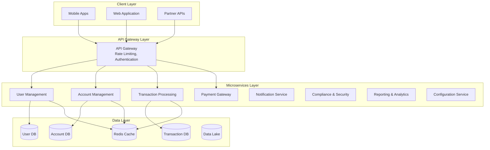
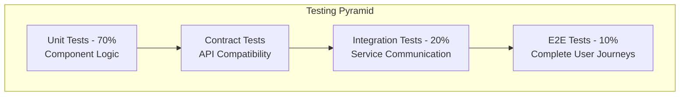
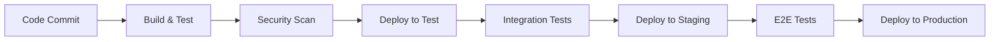

# eWallet Application - Microservices Architecture

## Project Overview

**GlobalPay eWallet** is a comprehensive digital wallet application transforming from a monolithic architecture to a modern, scalable microservices-based system deployed on Alibaba Cloud. This project addresses the need for enhanced scalability, improved maintainability, and robust performance to handle high-volume financial transactions.

### Key Objectives

- **Scalability**: Support 100,000+ daily transactions with peak load handling
- **Modernization**: Transform monolithic system to microservices architecture
- **Performance**: Achieve sub-200ms response times for critical operations
- **Security**: Implement enterprise-grade security and compliance frameworks
- **Zero-Downtime Migration**: Ensure business continuity during transformation

## Architecture Overview

### Current State
- **Monolithic Java Spring Framework** application
- **Single MySQL database**
- **Tightly coupled modules** (user management, account balances, transfers)
- **Scalability limitations** during peak times

### Target State
- **8 Independent Microservices** with dedicated databases
- **Event-driven architecture** with message queues
- **Container orchestration** with Kubernetes (ACK)
- **Multi-layer caching** with Redis cluster
- **Comprehensive monitoring** and observability



## Project Structure

The eWallet project contains comprehensive documentation covering all aspects of the microservices transformation:

### Current Documentation Architecture

```
e-wallet/
├── README.md                              # Project overview and quick start guide
├── Overall_Solution_Analysis.md            # Complete system architecture and design
├── Performance_Optimization_Guide.md      # Scalability and performance tuning
├── Security_Compliance_Framework.md       # Security architecture and compliance
├── Testing_Strategy_QA_Framework.md       # Comprehensive testing approach
├── Data_Migration_Strategy.md             # Database design and migration plan
├── Detailed_Implementation_Guide.md       # Service-by-service implementation
└── SA-eWallet Application-300724-032846.pdf # Original project requirements
```

### Core Documentation Files

| Document | Purpose | Target Audience |
|----------|---------|-----------------|
| **README.md** | Project overview and quick start guide | All stakeholders |
| **Overall_Solution_Analysis.md** | Complete system architecture and transformation strategy | Architects, Senior Developers |
| **Performance_Optimization_Guide.md** | Scalability patterns and performance tuning | DevOps, Performance Engineers |
| **Security_Compliance_Framework.md** | Security architecture and regulatory compliance | Security Team, Compliance Officers |
| **Testing_Strategy_QA_Framework.md** | Comprehensive testing approach and quality assurance | QA Engineers, Developers |
| **Data_Migration_Strategy.md** | Database design and migration methodology | Database Architects, DevOps |
| **Detailed_Implementation_Guide.md** | Service-by-service implementation details | Developers, Technical Leads |
| **SA-eWallet Application-300724-032846.pdf** | Original project requirements and specifications | Product Managers, Stakeholders |

### Documentation Overview

The project is currently in the **design and planning phase** with comprehensive documentation covering:

- **Architecture Design**: Complete microservices transformation strategy
- **Performance Planning**: Scalability and optimization approaches  
- **Security Framework**: Enterprise-grade security and compliance design
- **Testing Strategy**: Quality assurance and testing methodologies
- **Migration Planning**: Zero-downtime transformation approach
- **Implementation Roadmap**: Service-by-service development guide

All documentation follows enterprise standards and provides detailed technical specifications for the development phase.

## Getting Started

### Prerequisites for Documentation Review

- **Markdown Viewer** - For reading documentation files
- **Mermaid Support** - For viewing architecture diagrams (VS Code with Mermaid extension recommended)
- **PDF Reader** - For viewing the original requirements document

### Current Project Status

This project is currently in the **design and planning phase**. The repository contains comprehensive technical documentation for the eWallet microservices transformation.

#### Available Documentation

1. **Review the documentation files** in order:
   ```bash
   # Start with project overview
   README.md
   
   # Review architecture and system design
   Overall_Solution_Analysis.md
   
   # Study performance and scalability planning
   Performance_Optimization_Guide.md
   
   # Examine security and compliance framework
   Security_Compliance_Framework.md
   
   # Understand testing strategy
   Testing_Strategy_QA_Framework.md
   
   # Review data migration approach
   Data_Migration_Strategy.md
   
   # Study implementation roadmap
   Detailed_Implementation_Guide.md
   ```

2. **Reference the original requirements**:
   ```
   SA-eWallet Application-300724-032846.pdf
   ```

### Future Implementation Phase

The actual microservices development will begin after the design phase is complete. Future implementation will include:

- **Source code** for 8 microservices
- **Docker configurations** for containerization
- **Kubernetes manifests** for orchestration
- **Database migration scripts** for data transformation
- **CI/CD pipelines** for automated deployment
- **Monitoring and logging** setup scripts

## Business Requirements

### Core Functional Requirements

#### User Management
- User registration and authentication
- Profile management and KYC verification
- Multi-factor authentication (2FA)
- Role-based access control (RBAC)

#### Account Management
- Digital wallet account creation
- Real-time balance tracking
- Multiple currency support
- Account limits and controls

#### Transaction Processing
- Peer-to-peer transfers
- Account reloading (top-up)
- Payment processing
- Transaction history and receipts

#### Financial Operations
- Real-time fund transfers
- Payment gateway integration
- Refund processing
- Transaction reconciliation

### Performance Requirements

| Metric | Requirement | Current State | Target State |
|--------|-------------|---------------|--------------|
| **Daily Transactions** | 100,000+ | Struggling at peak | Seamless handling |
| **Response Time (P95)** | <200ms | Variable | <100ms |
| **Availability** | 99.9% | 95-98% | 99.95% |
| **Concurrent Users** | 10,000+ | Limited | Scalable |
| **Data Consistency** | 100% | Manual reconciliation | Real-time |

## Technology Stack

### Backend Services
- **Java 17** - Primary programming language
- **Spring Boot 3.x** - Microservices framework
- **Spring Security** - Authentication and authorization
- **Spring Data JPA** - Data persistence
- **Spring Cloud Gateway** - API gateway and routing

### Databases
- **MySQL 8.0** - Primary transactional database
- **Redis 7.x** - Caching and session storage
- **Alibaba Cloud RDS** - Managed database service

### Infrastructure
- **Alibaba Cloud** - Primary cloud provider
- **Container Service for Kubernetes (ACK)** - Container orchestration
- **Alibaba Cloud MQ** - Message queuing
- **Object Storage Service (OSS)** - File and document storage

### Monitoring & Security
- **CloudOps** - Application monitoring
- **Simple Log Service (SLS)** - Centralized logging
- **Web Application Firewall (WAF)** - Security protection
- **Anti-DDoS** - DDoS protection

## System Performance Targets

### Service Level Agreements (SLAs)

| Service | Response Time (P95) | Throughput | Availability | Recovery Time |
|---------|-------------------|------------|--------------|---------------|
| **User Management** | <100ms | 5,000 RPS | 99.9% | <5 minutes |
| **Account Management** | <50ms | 10,000 RPS | 99.95% | <3 minutes |
| **Transaction Processing** | <200ms | 15,000 TPS | 99.99% | <2 minutes |
| **Payment Gateway** | <500ms | 5,000 TPS | 99.9% | <5 minutes |
| **Notification Service** | <1000ms | 20,000 MPS | 99.5% | <10 minutes |

### Scalability Metrics

| Component | Current Capacity | Target Capacity | Scaling Method |
|-----------|------------------|-----------------|----------------|
| **API Gateway** | 5,000 RPS | 50,000 RPS | Horizontal + Load Balancing |
| **Database Layer** | 5,000 QPS | 50,000 QPS | Read Replicas + Sharding |
| **Cache Layer** | 10,000 ops/sec | 100,000 ops/sec | Redis Cluster Scaling |

## Security & Compliance

### Security Framework
- **Multi-layer security architecture** with network, application, and data protection
- **JWT-based authentication** with refresh token rotation
- **Role-based access control (RBAC)** with fine-grained permissions
- **Field-level encryption** for sensitive data (PII, financial data)
- **Real-time fraud detection** using ML algorithms

### Compliance Standards
- **PCI DSS Level 1** - Payment card industry compliance
- **AML (Anti-Money Laundering)** - Transaction monitoring and reporting
- **KYC (Know Your Customer)** - Identity verification and due diligence
- **Data Privacy Regulations** - GDPR, CCPA compliance
- **SOX Controls** - Financial reporting and audit trails

### Fraud Prevention
- **Real-time transaction monitoring** with ML-based risk scoring
- **Behavioral analytics** for anomaly detection
- **Device fingerprinting** and location tracking
- **Velocity checks** and transaction limits
- **Blacklist management** and sanctions screening

## Testing Strategy

### Testing Pyramid Approach



### Testing Coverage Targets

| Test Type | Coverage Target | Execution Time | Environment |
|-----------|----------------|----------------|-------------|
| **Unit Tests** | 90%+ code coverage | <5 minutes | Local/CI |
| **Integration Tests** | 80%+ critical paths | <15 minutes | CI/Test Environment |
| **Contract Tests** | 100% API contracts | <10 minutes | CI |
| **Performance Tests** | Key scenarios | <30 minutes | Performance Environment |
| **Security Tests** | Critical vulnerabilities | <20 minutes | Security Environment |
| **E2E Tests** | Critical user journeys | <45 minutes | Staging Environment |

## Migration Strategy

### Phase-by-Phase Approach

#### Phase 1: Foundation (Months 1-2)
- Set up Alibaba Cloud infrastructure
- Implement API Gateway and service mesh
- Create CI/CD pipelines
- Set up monitoring and logging

#### Phase 2: Core Services Migration (Months 3-4)
- Extract User Management Service
- Extract Account Management Service
- Implement event-driven communication

#### Phase 3: Transaction Services (Months 5-6)
- Extract Transaction Processing Service
- Extract Payment Gateway Service
- Implement distributed transaction management

#### Phase 4: Supporting Services (Months 7-8)
- Extract Notification Service
- Extract Compliance & Security Service
- Extract Reporting & Analytics Service

#### Phase 5: Optimization & Cutover (Months 9-10)
- Performance optimization
- Complete migration and monolith decommission
- Final testing and go-live

### Migration Principles
- **Zero-downtime migration** using strangler fig pattern
- **Data consistency** validation throughout the process
- **Rollback capabilities** at each phase
- **Gradual traffic shifting** from monolith to microservices
- **Comprehensive monitoring** during migration

## Documentation

### Technical Documentation
- **[Overall Solution Analysis](Overall_Solution_Analysis.md)** - Complete system architecture and design
- **[Performance Optimization Guide](Performance_Optimization_Guide.md)** - Scalability and performance tuning
- **[Security Compliance Framework](Security_Compliance_Framework.md)** - Security architecture and compliance
- **[Testing Strategy & QA Framework](Testing_Strategy_QA_Framework.md)** - Comprehensive testing approach
- **[Data Migration Strategy](Data_Migration_Strategy.md)** - Database design and migration plan
- **[Detailed Implementation Guide](Detailed_Implementation_Guide.md)** - Service implementation details

### API Documentation
- **User Management API** - RESTful APIs for user operations
- **Account Management API** - Account and balance management endpoints
- **Transaction Processing API** - Payment and transfer operations
- **Payment Gateway API** - External payment provider integration
- **Notification API** - Communication and alert services

## Contributing

### Development Workflow
1. **Create feature branch** from `develop`
2. **Implement changes** following coding standards
3. **Write comprehensive tests** (unit, integration, contract)
4. **Update documentation** as needed
5. **Submit pull request** for code review
6. **Merge after approval** and CI/CD validation

### Code Standards
- **Java Code Style** - Google Java Style Guide
- **API Design** - RESTful principles and OpenAPI 3.0
- **Database Design** - Normalized schemas with proper indexing
- **Security** - OWASP guidelines and secure coding practices
- **Testing** - TDD approach with comprehensive coverage

### Review Process
- **Code Review** - Mandatory for all changes
- **Security Review** - For security-related modifications
- **Architecture Review** - For significant design changes
- **Performance Review** - For performance-critical components

## Deployment

### Environment Strategy
- **Development** - Local development and unit testing
- **Testing** - Integration and contract testing
- **Staging** - User acceptance testing and performance validation
- **Production** - Live system with full monitoring

### CI/CD Pipeline


### Infrastructure as Code
- **Terraform** - Infrastructure provisioning
- **Kubernetes Manifests** - Container orchestration
- **Helm Charts** - Application deployment
- **GitOps** - Configuration management

## Support & Contact

### Development Team
- **Architecture Team** - System design and technical decisions
- **Backend Team** - Microservices development
- **DevOps Team** - Infrastructure and deployment
- **QA Team** - Testing and quality assurance
- **Security Team** - Security and compliance

### Communication Channels
- **Slack** - Daily communication and quick questions
- **JIRA** - Issue tracking and project management
- **Confluence** - Knowledge base and documentation
- **Email** - Formal communication and notifications

## License

This project is proprietary software owned by GlobalPay. All rights reserved.

**Confidential and Proprietary Information**  
This document contains confidential and proprietary information belonging to GlobalPay. Any reproduction or distribution of this material, in whole or in part, is strictly prohibited without written authorization from GlobalPay.

---

**Document Information:**
- **Version:** 1.0
- **Date:** June 29, 2025
- **Last Updated:** June 29, 2025
- **Author:** Shazwan
- **Status:** Active Development

**Quick Links:**
- [Project Requirements](SA-eWallet%20Application-300724-032846.pdf)
- [Architecture Overview](Overall_Solution_Analysis.md)
- [Security Framework](Security_Compliance_Framework.md)
- [Performance Guide](Performance_Optimization_Guide.md)
- [Testing Strategy](Testing_Strategy_QA_Framework.md)
