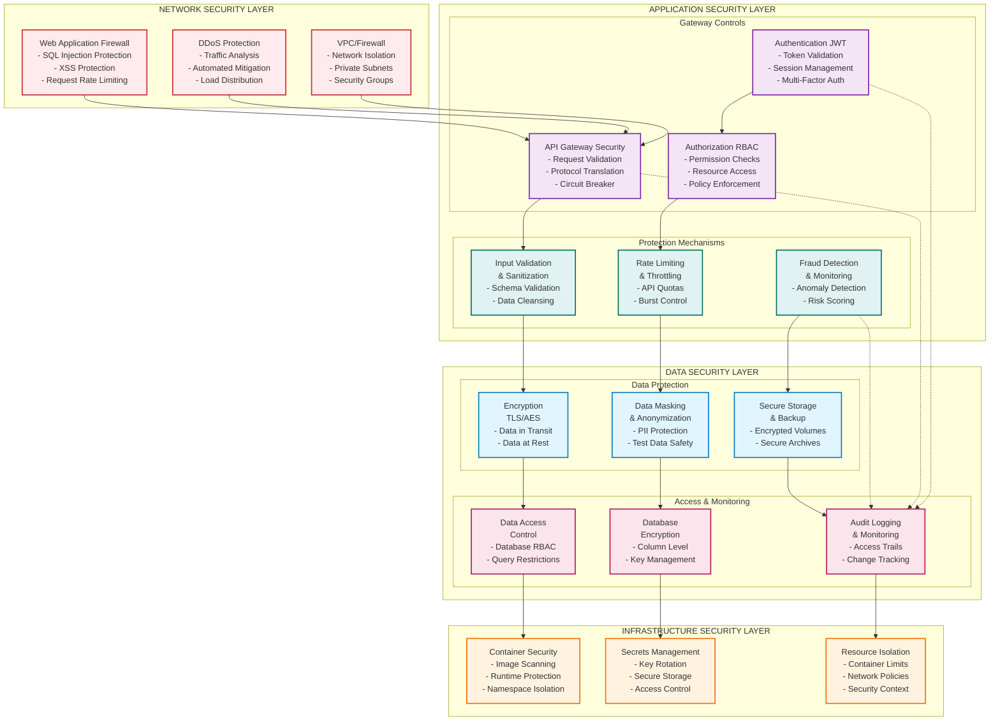

# Security and Compliance Framework

## 1. Security Architecture Overview

### 1.1 Multi-Layer Security Design



### 1.2 Authentication and Authorization Framework

#### 1.2.1 JWT-Based Authentication Implementation

```java
@Service
public class AuthenticationService {
    
    @Autowired
    private UserRepository userRepository;
    
    @Autowired
    private PasswordEncoder passwordEncoder;
    
    @Autowired
    private JwtTokenProvider jwtTokenProvider;
    
    @Autowired
    private TwoFactorAuthService twoFactorAuthService;
    
    @Autowired
    private SecurityEventPublisher securityEventPublisher;
    
    public AuthenticationResponse authenticate(AuthenticationRequest request) {
        try {
            // 1. Validate user credentials
            User user = validateCredentials(request.getEmail(), request.getPassword());
            
            // 2. Check account status
            validateAccountStatus(user);
            
            // 3. Handle two-factor authentication if enabled
            if (user.isTwoFactorEnabled()) {
                return handleTwoFactorAuth(user, request.getTwoFactorCode());
            }
            
            // 4. Generate JWT tokens
            String accessToken = jwtTokenProvider.generateAccessToken(user);
            String refreshToken = jwtTokenProvider.generateRefreshToken(user);
            
            // 5. Update login metadata
            updateLoginMetadata(user, request.getDeviceInfo(), request.getIpAddress());
            
            // 6. Publish security event
            securityEventPublisher.publishSuccessfulLogin(user, request.getIpAddress());
            
            return AuthenticationResponse.builder()
                .accessToken(accessToken)
                .refreshToken(refreshToken)
                .expiresIn(jwtTokenProvider.getAccessTokenExpiration())
                .tokenType("Bearer")
                .user(UserResponse.from(user))
                .build();
                
        } catch (InvalidCredentialsException e) {
            handleFailedLogin(request.getEmail(), request.getIpAddress());
            throw e;
        }
    }
    
    private User validateCredentials(String email, String password) {
        User user = userRepository.findByEmail(email)
            .orElseThrow(() -> new InvalidCredentialsException("Invalid email or password"));
        
        if (!passwordEncoder.matches(password, user.getPasswordHash())) {
            throw new InvalidCredentialsException("Invalid email or password");
        }
        
        return user;
    }
    
    private void validateAccountStatus(User user) {
        if (user.getStatus() == UserStatus.SUSPENDED) {
            throw new AccountSuspendedException("Account is suspended");
        }
        
        if (user.getStatus() == UserStatus.INACTIVE) {
            throw new AccountInactiveException("Account is inactive");
        }
        
        if (user.isLocked()) {
            throw new AccountLockedException("Account is temporarily locked");
        }
    }
    
    private void handleFailedLogin(String email, String ipAddress) {
        Optional<User> userOpt = userRepository.findByEmail(email);
        if (userOpt.isPresent()) {
            User user = userOpt.get();
            user.incrementFailedLoginAttempts();
            
            if (user.getFailedLoginAttempts() >= 5) {
                user.lockAccount(Duration.ofMinutes(30));
                securityEventPublisher.publishAccountLocked(user, ipAddress);
            }
            
            userRepository.save(user);
        }
        
        securityEventPublisher.publishFailedLogin(email, ipAddress);
    }
}

@Component
public class JwtTokenProvider {
    
    @Value("${security.jwt.secret}")
    private String jwtSecret;
    
    @Value("${security.jwt.access-token-expiration}")
    private long accessTokenExpiration;
    
    @Value("${security.jwt.refresh-token-expiration}")
    private long refreshTokenExpiration;
    
    public String generateAccessToken(User user) {
        Date expiryDate = new Date(System.currentTimeMillis() + accessTokenExpiration);
        
        return Jwts.builder()
            .setSubject(user.getId())
            .setIssuedAt(new Date())
            .setExpiration(expiryDate)
            .claim("email", user.getEmail())
            .claim("roles", user.getRoles())
            .claim("permissions", user.getPermissions())
            .claim("type", "access")
            .signWith(SignatureAlgorithm.HS512, jwtSecret)
            .compact();
    }
    
    public String generateRefreshToken(User user) {
        Date expiryDate = new Date(System.currentTimeMillis() + refreshTokenExpiration);
        
        return Jwts.builder()
            .setSubject(user.getId())
            .setIssuedAt(new Date())
            .setExpiration(expiryDate)
            .claim("type", "refresh")
            .signWith(SignatureAlgorithm.HS512, jwtSecret)
            .compact();
    }
    
    public boolean validateToken(String token) {
        try {
            Jwts.parser().setSigningKey(jwtSecret).parseClaimsJws(token);
            return true;
        } catch (JwtException | IllegalArgumentException e) {
            return false;
        }
    }
    
    public String getUserIdFromToken(String token) {
        Claims claims = Jwts.parser()
            .setSigningKey(jwtSecret)
            .parseClaimsJws(token)
            .getBody();
        
        return claims.getSubject();
    }
}
```

#### 1.2.2 Role-Based Access Control (RBAC)

```java
@Entity
@Table(name = "roles")
public class Role {
    @Id
    private String id;
    
    @Column(unique = true)
    private String name;
    
    private String description;
    
    @ManyToMany(fetch = FetchType.LAZY)
    @JoinTable(
        name = "role_permissions",
        joinColumns = @JoinColumn(name = "role_id"),
        inverseJoinColumns = @JoinColumn(name = "permission_id")
    )
    private Set<Permission> permissions = new HashSet<>();
    
    // Getters and setters
}

@Entity
@Table(name = "permissions")
public class Permission {
    @Id
    private String id;
    
    @Column(unique = true)
    private String name;
    
    private String description;
    
    @Enumerated(EnumType.STRING)
    private ResourceType resourceType;
    
    @Enumerated(EnumType.STRING)
    private ActionType actionType;
    
    // Getters and setters
}

@Entity
@Table(name = "user_roles")
public class UserRole {
    @Id
    private String id;
    
    @Column(name = "user_id")
    private String userId;
    
    @ManyToOne
    @JoinColumn(name = "role_id")
    private Role role;
    
    @Column(name = "assigned_at")
    private LocalDateTime assignedAt;
    
    @Column(name = "assigned_by")
    private String assignedBy;
    
    @Column(name = "expires_at")
    private LocalDateTime expiresAt;
    
    @Column(name = "is_active")
    private Boolean isActive = true;
    
    // Getters and setters
}

@Service
public class AuthorizationService {
    
    @Autowired
    private UserRoleRepository userRoleRepository;
    
    @Autowired
    private PermissionRepository permissionRepository;
    
    public boolean hasPermission(String userId, String resource, String action) {
        List<Permission> userPermissions = getUserPermissions(userId);
        
        return userPermissions.stream()
            .anyMatch(permission -> 
                permission.getResourceType().name().equalsIgnoreCase(resource) &&
                permission.getActionType().name().equalsIgnoreCase(action)
            );
    }
    
    public List<Permission> getUserPermissions(String userId) {
        List<UserRole> userRoles = userRoleRepository.findActiveRolesByUserId(userId);
        
        return userRoles.stream()
            .flatMap(userRole -> userRole.getRole().getPermissions().stream())
            .distinct()
            .collect(Collectors.toList());
    }
    
    public boolean canAccessAccount(String userId, String accountId) {
        // Check if user owns the account or has admin privileges
        return hasPermission(userId, "ACCOUNT", "READ") || 
               accountService.isAccountOwner(userId, accountId);
    }
    
    public boolean canPerformTransaction(String userId, String accountId, BigDecimal amount) {
        // Check transaction permissions and limits
        if (!hasPermission(userId, "TRANSACTION", "CREATE")) {
            return false;
        }
        
        if (!accountService.isAccountOwner(userId, accountId)) {
            return false;
        }
        
        // Check transaction limits
        return transactionLimitService.isWithinLimits(userId, accountId, amount);
    }
}
```

### 1.3 Data Encryption and Protection

#### 1.3.1 Encryption Implementation

```java
@Service
public class EncryptionService {
    
    @Value("${security.encryption.key}")
    private String encryptionKey;
    
    @Value("${security.encryption.algorithm}")
    private String algorithm = "AES/GCM/NoPadding";
    
    private SecretKeySpec secretKey;
    
    @PostConstruct
    public void initKey() {
        try {
            MessageDigest sha = MessageDigest.getInstance("SHA-256");
            byte[] key = sha.digest(encryptionKey.getBytes(StandardCharsets.UTF_8));
            secretKey = new SecretKeySpec(key, "AES");
        } catch (NoSuchAlgorithmException e) {
            throw new SecurityException("Failed to initialize encryption key", e);
        }
    }
    
    public String encrypt(String data) {
        try {
            Cipher cipher = Cipher.getInstance(algorithm);
            cipher.init(Cipher.ENCRYPT_MODE, secretKey);
            
            byte[] encryptedData = cipher.doFinal(data.getBytes(StandardCharsets.UTF_8));
            byte[] iv = cipher.getIV();
            
            // Combine IV and encrypted data
            byte[] encryptedWithIv = new byte[iv.length + encryptedData.length];
            System.arraycopy(iv, 0, encryptedWithIv, 0, iv.length);
            System.arraycopy(encryptedData, 0, encryptedWithIv, iv.length, encryptedData.length);
            
            return Base64.getEncoder().encodeToString(encryptedWithIv);
        } catch (Exception e) {
            throw new SecurityException("Failed to encrypt data", e);
        }
    }
    
    public String decrypt(String encryptedData) {
        try {
            byte[] decodedData = Base64.getDecoder().decode(encryptedData);
            
            // Extract IV and encrypted data
            byte[] iv = new byte[12]; // GCM IV length
            byte[] encrypted = new byte[decodedData.length - 12];
            System.arraycopy(decodedData, 0, iv, 0, 12);
            System.arraycopy(decodedData, 12, encrypted, 0, encrypted.length);
            
            Cipher cipher = Cipher.getInstance(algorithm);
            GCMParameterSpec gcmParameterSpec = new GCMParameterSpec(128, iv);
            cipher.init(Cipher.DECRYPT_MODE, secretKey, gcmParameterSpec);
            
            byte[] decryptedData = cipher.doFinal(encrypted);
            return new String(decryptedData, StandardCharsets.UTF_8);
        } catch (Exception e) {
            throw new SecurityException("Failed to decrypt data", e);
        }
    }
}

@Entity
@Table(name = "sensitive_data")
public class SensitiveData {
    @Id
    private String id;
    
    @Convert(converter = EncryptedStringConverter.class)
    @Column(name = "encrypted_data")
    private String sensitiveValue;
    
    @Column(name = "data_type")
    private String dataType;
    
    @Column(name = "owner_id")
    private String ownerId;
    
    // Getters and setters
}

@Converter
public class EncryptedStringConverter implements AttributeConverter<String, String> {
    
    @Autowired
    private EncryptionService encryptionService;
    
    @Override
    public String convertToDatabaseColumn(String attribute) {
        if (attribute == null) {
            return null;
        }
        return encryptionService.encrypt(attribute);
    }
    
    @Override
    public String convertToEntityAttribute(String dbData) {
        if (dbData == null) {
            return null;
        }
        return encryptionService.decrypt(dbData);
    }
}
```

#### 1.3.2 PII Data Masking

```java
@Service
public class DataMaskingService {
    
    public String maskEmail(String email) {
        if (email == null || !email.contains("@")) {
            return email;
        }
        
        String[] parts = email.split("@");
        String username = parts[0];
        String domain = parts[1];
        
        if (username.length() <= 2) {
            return "**@" + domain;
        }
        
        return username.substring(0, 2) + "***@" + domain;
    }
    
    public String maskPhoneNumber(String phoneNumber) {
        if (phoneNumber == null || phoneNumber.length() < 4) {
            return phoneNumber;
        }
        
        return phoneNumber.substring(0, 3) + "****" + phoneNumber.substring(phoneNumber.length() - 2);
    }
    
    public String maskCardNumber(String cardNumber) {
        if (cardNumber == null || cardNumber.length() < 8) {
            return cardNumber;
        }
        
        return cardNumber.substring(0, 4) + "********" + cardNumber.substring(cardNumber.length() - 4);
    }
    
    public String maskAccountNumber(String accountNumber) {
        if (accountNumber == null || accountNumber.length() < 6) {
            return accountNumber;
        }
        
        return "****" + accountNumber.substring(accountNumber.length() - 4);
    }
    
    public UserResponse maskUserData(User user, String requestingUserId) {
        UserResponse response = UserResponse.from(user);
        
        // Only show full data to the user themselves or admin users
        if (!user.getId().equals(requestingUserId) && !isAdminUser(requestingUserId)) {
            response.setEmail(maskEmail(user.getEmail()));
            response.setPhoneNumber(maskPhoneNumber(user.getPhoneNumber()));
        }
        
        return response;
    }
    
    private boolean isAdminUser(String userId) {
        return authorizationService.hasPermission(userId, "USER", "ADMIN");
    }
}
```

### 1.4 Fraud Detection and Prevention

#### 1.4.1 Real-time Fraud Detection

```java
@Service
@Slf4j
public class FraudDetectionService {
    
    @Autowired
    private TransactionHistoryService transactionHistoryService;
    
    @Autowired
    private UserBehaviorService userBehaviorService;
    
    @Autowired
    private GeolocationService geolocationService;
    
    @Autowired
    private MachineLearningService mlService;
    
    @Autowired
    private AlertService alertService;
    
    public FraudAssessment assessTransaction(TransactionRequest request) {
        log.info("Assessing fraud risk for transaction: {}", request.getId());
        
        FraudAssessment assessment = new FraudAssessment();
        assessment.setTransactionId(request.getId());
        assessment.setUserId(request.getUserId());
        
        // 1. Amount-based checks
        assessAmountRisk(request, assessment);
        
        // 2. Velocity checks
        assessVelocityRisk(request, assessment);
        
        // 3. Geolocation checks
        assessGeolocationRisk(request, assessment);
        
        // 4. Behavioral analysis
        assessBehavioralRisk(request, assessment);
        
        // 5. Machine learning model
        assessMLRisk(request, assessment);
        
        // 6. Calculate overall risk score
        calculateOverallRisk(assessment);
        
        // 7. Determine action
        determineAction(assessment);
        
        log.info("Fraud assessment completed: Risk Score = {}, Action = {}", 
            assessment.getRiskScore(), assessment.getRecommendedAction());
        
        return assessment;
    }
    
    private void assessAmountRisk(TransactionRequest request, FraudAssessment assessment) {
        BigDecimal amount = request.getAmount();
        BigDecimal userAverageTransaction = transactionHistoryService.getAverageTransactionAmount(request.getUserId());
        
        if (amount.compareTo(userAverageTransaction.multiply(BigDecimal.valueOf(10))) > 0) {
            assessment.addRiskFactor("AMOUNT_ANOMALY", 0.3);
        }
        
        if (amount.compareTo(BigDecimal.valueOf(10000)) > 0) {
            assessment.addRiskFactor("HIGH_AMOUNT", 0.2);
        }
    }
    
    private void assessVelocityRisk(TransactionRequest request, FraudAssessment assessment) {
        String userId = request.getUserId();
        LocalDateTime now = LocalDateTime.now();
        
        // Check transactions in last hour
        int transactionsLastHour = transactionHistoryService.countTransactions(
            userId, now.minusHours(1), now);
        
        if (transactionsLastHour > 10) {
            assessment.addRiskFactor("HIGH_VELOCITY_HOUR", 0.4);
        }
        
        // Check transactions in last day
        int transactionsLastDay = transactionHistoryService.countTransactions(
            userId, now.minusDays(1), now);
        
        if (transactionsLastDay > 50) {
            assessment.addRiskFactor("HIGH_VELOCITY_DAY", 0.3);
        }
        
        // Check for rapid consecutive transactions
        LocalDateTime lastTransaction = transactionHistoryService.getLastTransactionTime(userId);
        if (lastTransaction != null && Duration.between(lastTransaction, now).toMinutes() < 1) {
            assessment.addRiskFactor("RAPID_CONSECUTIVE", 0.3);
        }
    }
    
    private void assessGeolocationRisk(TransactionRequest request, FraudAssessment assessment) {
        String ipAddress = request.getIpAddress();
        String userId = request.getUserId();
        
        // Get location from IP
        GeolocationInfo currentLocation = geolocationService.getLocation(ipAddress);
        GeolocationInfo userHomeLocation = userBehaviorService.getUserHomeLocation(userId);
        
        if (currentLocation != null && userHomeLocation != null) {
            double distance = geolocationService.calculateDistance(currentLocation, userHomeLocation);
            
            if (distance > 1000) { // More than 1000 km from home
                assessment.addRiskFactor("DISTANT_LOCATION", 0.3);
            }
            
            if (geolocationService.isHighRiskCountry(currentLocation.getCountry())) {
                assessment.addRiskFactor("HIGH_RISK_COUNTRY", 0.4);
            }
        }
        
        // Check for VPN/Proxy usage
        if (geolocationService.isVpnOrProxy(ipAddress)) {
            assessment.addRiskFactor("VPN_PROXY_USAGE", 0.2);
        }
    }
    
    private void assessBehavioralRisk(TransactionRequest request, FraudAssessment assessment) {
        String userId = request.getUserId();
        
        // Check typical transaction patterns
        UserBehaviorProfile profile = userBehaviorService.getUserBehaviorProfile(userId);
        
        // Time-based analysis
        LocalTime transactionTime = LocalTime.now();
        if (!profile.isTypicalTransactionTime(transactionTime)) {
            assessment.addRiskFactor("UNUSUAL_TIME", 0.2);
        }
        
        // Recipient analysis
        String recipientId = request.getRecipientId();
        if (recipientId != null && !profile.isKnownRecipient(recipientId)) {
            assessment.addRiskFactor("NEW_RECIPIENT", 0.1);
        }
        
        // Device analysis
        String deviceFingerprint = request.getDeviceFingerprint();
        if (deviceFingerprint != null && !profile.isKnownDevice(deviceFingerprint)) {
            assessment.addRiskFactor("NEW_DEVICE", 0.2);
        }
    }
    
    private void assessMLRisk(TransactionRequest request, FraudAssessment assessment) {
        try {
            MLFraudPrediction prediction = mlService.predictFraud(request);
            
            if (prediction.getFraudProbability() > 0.7) {
                assessment.addRiskFactor("ML_HIGH_RISK", 0.5);
            } else if (prediction.getFraudProbability() > 0.4) {
                assessment.addRiskFactor("ML_MEDIUM_RISK", 0.3);
            }
            
            assessment.setMlPrediction(prediction);
        } catch (Exception e) {
            log.warn("ML fraud detection failed for transaction: {}", request.getId(), e);
            // Fallback to rule-based assessment
        }
    }
    
    private void calculateOverallRisk(FraudAssessment assessment) {
        double totalRisk = assessment.getRiskFactors().values().stream()
            .mapToDouble(Double::doubleValue)
            .sum();
        
        // Normalize risk score to 0-1 range
        double normalizedRisk = Math.min(totalRisk, 1.0);
        assessment.setRiskScore(normalizedRisk);
    }
    
    private void determineAction(FraudAssessment assessment) {
        double riskScore = assessment.getRiskScore();
        
        if (riskScore >= 0.8) {
            assessment.setRecommendedAction(FraudAction.BLOCK);
            alertService.sendHighRiskAlert(assessment);
        } else if (riskScore >= 0.5) {
            assessment.setRecommendedAction(FraudAction.REVIEW);
            alertService.sendMediumRiskAlert(assessment);
        } else if (riskScore >= 0.3) {
            assessment.setRecommendedAction(FraudAction.MONITOR);
        } else {
            assessment.setRecommendedAction(FraudAction.ALLOW);
        }
    }
}

@Entity
@Table(name = "fraud_assessments")
public class FraudAssessment {
    @Id
    private String id;
    
    @Column(name = "transaction_id")
    private String transactionId;
    
    @Column(name = "user_id")
    private String userId;
    
    @Column(name = "risk_score")
    private Double riskScore;
    
    @Convert(converter = JsonConverter.class)
    @Column(name = "risk_factors")
    private Map<String, Double> riskFactors = new HashMap<>();
    
    @Enumerated(EnumType.STRING)
    @Column(name = "recommended_action")
    private FraudAction recommendedAction;
    
    @Column(name = "assessed_at")
    private LocalDateTime assessedAt;
    
    @Convert(converter = JsonConverter.class)
    @Column(name = "ml_prediction")
    private MLFraudPrediction mlPrediction;
    
    public void addRiskFactor(String factor, Double weight) {
        this.riskFactors.put(factor, weight);
    }
    
    // Getters and setters
}
```

### 1.5 Compliance and Regulatory Framework

#### 1.5.1 AML (Anti-Money Laundering) Implementation

```java
@Service
public class AMLComplianceService {
    
    @Autowired
    private TransactionAnalysisService transactionAnalysisService;
    
    @Autowired
    private WatchlistService watchlistService;
    
    @Autowired
    private SuspiciousActivityReportingService sarService;
    
    public AMLAssessment performAMLCheck(TransactionRequest request) {
        AMLAssessment assessment = new AMLAssessment();
        assessment.setTransactionId(request.getId());
        assessment.setUserId(request.getUserId());
        
        // 1. Watchlist screening
        performWatchlistScreening(request, assessment);
        
        // 2. Large transaction reporting
        checkLargeTransactionReporting(request, assessment);
        
        // 3. Pattern analysis
        performPatternAnalysis(request, assessment);
        
        // 4. Geographic risk assessment
        assessGeographicRisk(request, assessment);
        
        // 5. PEP (Politically Exposed Person) screening
        performPEPScreening(request, assessment);
        
        // 6. Structured transaction detection
        detectStructuredTransactions(request, assessment);
        
        return assessment;
    }
    
    private void performWatchlistScreening(TransactionRequest request, AMLAssessment assessment) {
        // Screen against OFAC, UN, EU sanctions lists
        boolean isOnWatchlist = watchlistService.screenUser(request.getUserId());
        
        if (request.getRecipientId() != null) {
            isOnWatchlist = isOnWatchlist || watchlistService.screenUser(request.getRecipientId());
        }
        
        if (isOnWatchlist) {
            assessment.addFlag(AMLFlag.WATCHLIST_MATCH);
            assessment.setRiskLevel(AMLRiskLevel.HIGH);
        }
    }
    
    private void checkLargeTransactionReporting(TransactionRequest request, AMLAssessment assessment) {
        BigDecimal threshold = new BigDecimal("10000"); // $10,000 threshold
        
        if (request.getAmount().compareTo(threshold) >= 0) {
            assessment.addFlag(AMLFlag.LARGE_TRANSACTION);
            assessment.setRequiresCTR(true); // Currency Transaction Report
        }
    }
    
    private void performPatternAnalysis(TransactionRequest request, AMLAssessment assessment) {
        String userId = request.getUserId();
        LocalDateTime now = LocalDateTime.now();
        
        // Check for rapid movement of funds
        List<Transaction> recentTransactions = transactionAnalysisService
            .getRecentTransactions(userId, now.minusDays(7));
        
        if (detectRapidFundMovement(recentTransactions)) {
            assessment.addFlag(AMLFlag.RAPID_FUND_MOVEMENT);
        }
        
        // Check for round-number transactions (layering indicator)
        if (isRoundNumber(request.getAmount())) {
            assessment.addFlag(AMLFlag.ROUND_NUMBER_TRANSACTION);
        }
        
        // Check for unusual transaction patterns
        if (detectUnusualPatterns(userId, request)) {
            assessment.addFlag(AMLFlag.UNUSUAL_PATTERN);
        }
    }
    
    private boolean detectStructuredTransactions(TransactionRequest request, AMLAssessment assessment) {
        String userId = request.getUserId();
        BigDecimal amount = request.getAmount();
        LocalDateTime now = LocalDateTime.now();
        
        // Look for multiple transactions just under reporting threshold
        BigDecimal threshold = new BigDecimal("10000");
        if (amount.compareTo(threshold.multiply(BigDecimal.valueOf(0.9))) >= 0 && 
            amount.compareTo(threshold) < 0) {
            
            // Check for similar transactions in recent days
            List<Transaction> recentSimilar = transactionAnalysisService
                .getSimilarAmountTransactions(userId, amount, now.minusDays(30));
            
            if (recentSimilar.size() >= 3) {
                assessment.addFlag(AMLFlag.STRUCTURED_TRANSACTIONS);
                assessment.setRiskLevel(AMLRiskLevel.HIGH);
                
                // File SAR (Suspicious Activity Report)
                sarService.fileSAR(userId, "Potential structuring detected", recentSimilar);
                return true;
            }
        }
        
        return false;
    }
}

@Entity
@Table(name = "aml_assessments")
public class AMLAssessment {
    @Id
    private String id;
    
    @Column(name = "transaction_id")
    private String transactionId;
    
    @Column(name = "user_id")
    private String userId;
    
    @Enumerated(EnumType.STRING)
    @Column(name = "risk_level")
    private AMLRiskLevel riskLevel = AMLRiskLevel.LOW;
    
    @ElementCollection(targetClass = AMLFlag.class)
    @Enumerated(EnumType.STRING)
    @Column(name = "flag")
    private Set<AMLFlag> flags = new HashSet<>();
    
    @Column(name = "requires_ctr")
    private Boolean requiresCTR = false;
    
    @Column(name = "requires_sar")
    private Boolean requiresSAR = false;
    
    @Column(name = "assessed_at")
    private LocalDateTime assessedAt;
    
    @Column(name = "assessed_by")
    private String assessedBy;
    
    public void addFlag(AMLFlag flag) {
        this.flags.add(flag);
    }
    
    // Getters and setters
}

public enum AMLFlag {
    WATCHLIST_MATCH,
    LARGE_TRANSACTION,
    RAPID_FUND_MOVEMENT,
    ROUND_NUMBER_TRANSACTION,
    UNUSUAL_PATTERN,
    STRUCTURED_TRANSACTIONS,
    PEP_INVOLVEMENT,
    HIGH_RISK_GEOGRAPHY,
    CASH_INTENSIVE_BUSINESS
}

public enum AMLRiskLevel {
    LOW, MEDIUM, HIGH, CRITICAL
}
```

#### 1.5.2 KYC (Know Your Customer) Implementation

```java
@Service
public class KYCService {
    
    @Autowired
    private DocumentVerificationService documentVerificationService;
    
    @Autowired
    private IdentityVerificationService identityVerificationService;
    
    @Autowired
    private BiometricVerificationService biometricVerificationService;
    
    @Autowired
    private ComplianceReportingService complianceReportingService;
    
    public KYCVerificationResult performKYCVerification(String userId, KYCRequest request) {
        KYCVerificationResult result = new KYCVerificationResult();
        result.setUserId(userId);
        result.setStartedAt(LocalDateTime.now());
        
        try {
            // 1. Document verification
            DocumentVerificationResult docResult = verifyDocuments(request.getDocuments());
            result.setDocumentVerification(docResult);
            
            // 2. Identity verification
            IdentityVerificationResult idResult = verifyIdentity(userId, request);
            result.setIdentityVerification(idResult);
            
            // 3. Address verification
            AddressVerificationResult addressResult = verifyAddress(request.getAddressProof());
            result.setAddressVerification(addressResult);
            
            // 4. Biometric verification (if required)
            if (request.getBiometricData() != null) {
                BiometricVerificationResult bioResult = verifyBiometrics(userId, request.getBiometricData());
                result.setBiometricVerification(bioResult);
            }
            
            // 5. Calculate overall KYC status
            calculateKYCStatus(result);
            
            // 6. Update user KYC status
            updateUserKYCStatus(userId, result);
            
            // 7. Generate compliance report
            complianceReportingService.generateKYCReport(result);
            
        } catch (Exception e) {
            result.setStatus(KYCStatus.FAILED);
            result.setFailureReason(e.getMessage());
        }
        
        result.setCompletedAt(LocalDateTime.now());
        return result;
    }
    
    private DocumentVerificationResult verifyDocuments(List<KYCDocument> documents) {
        DocumentVerificationResult result = new DocumentVerificationResult();
        
        for (KYCDocument document : documents) {
            try {
                // OCR extraction
                DocumentData extractedData = documentVerificationService.extractData(document);
                
                // Document authenticity check
                boolean isAuthentic = documentVerificationService.verifyAuthenticity(document);
                
                // Data validation
                boolean isValid = documentVerificationService.validateData(extractedData);
                
                DocumentVerification verification = DocumentVerification.builder()
                    .documentType(document.getType())
                    .isAuthentic(isAuthentic)
                    .isValid(isValid)
                    .extractedData(extractedData)
                    .confidenceScore(documentVerificationService.getConfidenceScore(document))
                    .build();
                
                result.addDocumentVerification(verification);
                
            } catch (Exception e) {
                DocumentVerification failedVerification = DocumentVerification.builder()
                    .documentType(document.getType())
                    .isAuthentic(false)
                    .isValid(false)
                    .failureReason(e.getMessage())
                    .build();
                
                result.addDocumentVerification(failedVerification);
            }
        }
        
        return result;
    }
    
    private void calculateKYCStatus(KYCVerificationResult result) {
        boolean allDocumentsValid = result.getDocumentVerification()
            .getDocumentVerifications().stream()
            .allMatch(doc -> doc.isAuthentic() && doc.isValid());
        
        boolean identityVerified = result.getIdentityVerification().isVerified();
        boolean addressVerified = result.getAddressVerification().isVerified();
        
        if (allDocumentsValid && identityVerified && addressVerified) {
            result.setStatus(KYCStatus.VERIFIED);
            result.setRiskLevel(calculateRiskLevel(result));
        } else {
            result.setStatus(KYCStatus.PENDING_REVIEW);
            result.setRiskLevel(KYCRiskLevel.HIGH);
        }
    }
    
    private KYCRiskLevel calculateRiskLevel(KYCVerificationResult result) {
        int riskScore = 0;
        
        // Document confidence scores
        double avgConfidence = result.getDocumentVerification()
            .getDocumentVerifications().stream()
            .mapToDouble(DocumentVerification::getConfidenceScore)
            .average().orElse(0.0);
        
        if (avgConfidence < 0.7) riskScore += 2;
        else if (avgConfidence < 0.9) riskScore += 1;
        
        // Geographic risk
        if (result.getIdentityVerification().isHighRiskCountry()) {
            riskScore += 2;
        }
        
        // PEP status
        if (result.getIdentityVerification().isPEP()) {
            riskScore += 3;
        }
        
        // Return risk level based on score
        if (riskScore >= 5) return KYCRiskLevel.HIGH;
        if (riskScore >= 3) return KYCRiskLevel.MEDIUM;
        return KYCRiskLevel.LOW;
    }
}
```

This comprehensive security and compliance framework provides:

1. **Multi-layer security architecture** with network, application, data, and infrastructure protection
2. **Advanced authentication and authorization** with JWT, 2FA, and RBAC
3. **Data encryption and PII protection** with field-level encryption and masking
4. **Real-time fraud detection** using ML and rule-based approaches
5. **AML compliance** with transaction monitoring and suspicious activity reporting
6. **KYC implementation** with document verification and identity validation

The framework ensures regulatory compliance while providing robust security for financial transactions and sensitive data.
