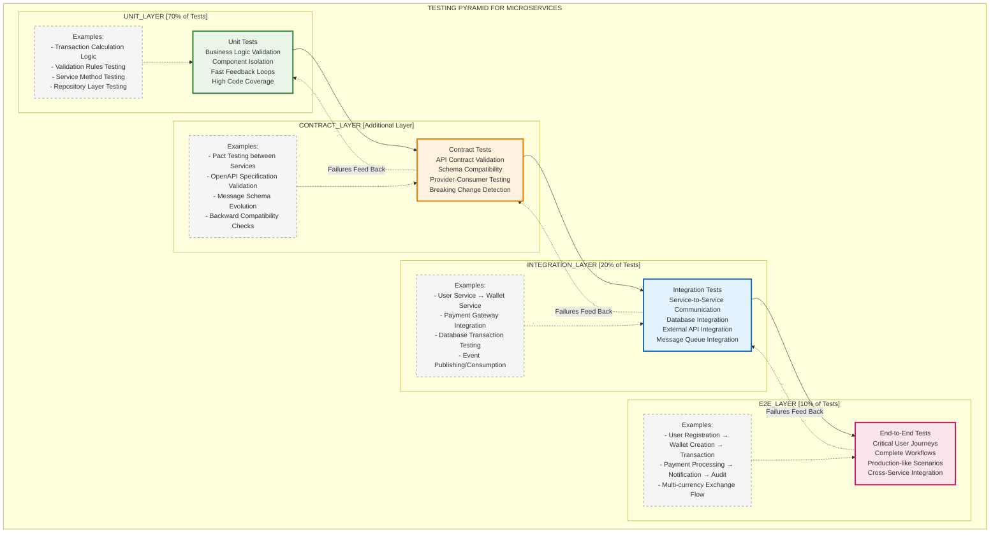

# Testing Strategy and Quality Assurance Framework

## 1. Comprehensive Testing Strategy Overview

### 1.1 Testing Pyramid for Microservices



#### Testing Layer Characteristics

| Layer | Test Count | Execution Speed | Scope | Feedback Time |
|-------|------------|-----------------|--------|---------------|
| **Unit Tests (70%)** | High Volume | Very Fast (<5 min) | Single Component | Immediate |
| **Contract Tests** | Medium Volume | Fast (<10 min) | API Boundaries | Quick |
| **Integration Tests (20%)** | Medium Volume | Moderate (<15 min) | Service Integration | Moderate |
| **E2E Tests (10%)** | Low Volume | Slow (<45 min) | Complete System | Delayed |

### 1.2 Testing Scope and Coverage Targets

| Test Type | Coverage Target | Execution Time | Environment |
|-----------|----------------|----------------|-------------|
| **Unit Tests** | 90%+ code coverage | <5 minutes | Local/CI |
| **Integration Tests** | 80%+ critical paths | <15 minutes | CI/Test Environment |
| **Contract Tests** | 100% API contracts | <10 minutes | CI |
| **Performance Tests** | Key scenarios | <30 minutes | Performance Environment |
| **Security Tests** | Critical vulnerabilities | <20 minutes | Security Environment |
| **E2E Tests** | Critical user journeys | <45 minutes | Staging Environment |

## 2. Unit Testing Framework

### 2.1 JUnit 5 and Mockito Implementation

```java
@ExtendWith(MockitoExtension.class)
class UserServiceTest {
    
    @Mock
    private UserRepository userRepository;
    
    @Mock
    private PasswordEncoder passwordEncoder;
    
    @Mock
    private EmailService emailService;
    
    @Mock
    private SecurityEventPublisher securityEventPublisher;
    
    @InjectMocks
    private UserService userService;
    
    @Test
    @DisplayName("Should create user successfully with valid data")
    void shouldCreateUserSuccessfully() {
        // Given
        CreateUserRequest request = CreateUserRequest.builder()
            .email("test@example.com")
            .firstName("John")
            .lastName("Doe")
            .password("SecurePass123!")
            .phoneNumber("+1234567890")
            .build();
        
        User expectedUser = User.builder()
            .id("user-123")
            .email(request.getEmail())
            .firstName(request.getFirstName())
            .lastName(request.getLastName())
            .status(UserStatus.PENDING_VERIFICATION)
            .build();
        
        when(userRepository.existsByEmail(request.getEmail())).thenReturn(false);
        when(passwordEncoder.encode(request.getPassword())).thenReturn("hashedPassword");
        when(userRepository.save(any(User.class))).thenReturn(expectedUser);
        
        // When
        User createdUser = userService.createUser(request);
        
        // Then
        assertThat(createdUser).isNotNull();
        assertThat(createdUser.getEmail()).isEqualTo(request.getEmail());
        assertThat(createdUser.getStatus()).isEqualTo(UserStatus.PENDING_VERIFICATION);
        
        verify(userRepository).existsByEmail(request.getEmail());
        verify(passwordEncoder).encode(request.getPassword());
        verify(userRepository).save(any(User.class));
        verify(emailService).sendVerificationEmail(eq(createdUser.getEmail()), anyString());
        verify(securityEventPublisher).publishUserCreated(createdUser);
    }
    
    @Test
    @DisplayName("Should throw exception when user already exists")
    void shouldThrowExceptionWhenUserExists() {
        // Given
        CreateUserRequest request = CreateUserRequest.builder()
            .email("existing@example.com")
            .firstName("John")
            .lastName("Doe")
            .password("SecurePass123!")
            .build();
        
        when(userRepository.existsByEmail(request.getEmail())).thenReturn(true);
        
        // When & Then
        assertThatThrownBy(() -> userService.createUser(request))
            .isInstanceOf(UserAlreadyExistsException.class)
            .hasMessage("User already exists with email: existing@example.com");
        
        verify(userRepository).existsByEmail(request.getEmail());
        verify(userRepository, never()).save(any(User.class));
        verify(emailService, never()).sendVerificationEmail(anyString(), anyString());
    }
    
    @ParameterizedTest
    @ValueSource(strings = {"", " ", "invalid-email", "@example.com", "test@"})
    @DisplayName("Should throw exception for invalid email formats")
    void shouldThrowExceptionForInvalidEmails(String invalidEmail) {
        // Given
        CreateUserRequest request = CreateUserRequest.builder()
            .email(invalidEmail)
            .firstName("John")
            .lastName("Doe")
            .password("SecurePass123!")
            .build();
        
        // When & Then
        assertThatThrownBy(() -> userService.createUser(request))
            .isInstanceOf(ValidationException.class);
    }
}

@TestMethodOrder(OrderAnnotation.class)
class TransactionServiceTest {
    
    @Mock
    private TransactionRepository transactionRepository;
    
    @Mock
    private AccountService accountService;
    
    @Mock
    private FraudDetectionService fraudDetectionService;
    
    @Mock
    private EventStore eventStore;
    
    @InjectMocks
    private TransactionService transactionService;
    
    private Account sourceAccount;
    private Account targetAccount;
    
    @BeforeEach
    void setUp() {
        sourceAccount = Account.builder()
            .id("acc-source")
            .userId("user-1")
            .availableBalance(new BigDecimal("1000.00"))
            .currency("USD")
            .status(AccountStatus.ACTIVE)
            .build();
        
        targetAccount = Account.builder()
            .id("acc-target")
            .userId("user-2")
            .availableBalance(new BigDecimal("500.00"))
            .currency("USD")
            .status(AccountStatus.ACTIVE)
            .build();
    }
    
    @Test
    @Order(1)
    @DisplayName("Should process transfer successfully with sufficient balance")
    void shouldProcessTransferSuccessfully() {
        // Given
        TransferRequest request = TransferRequest.builder()
            .sourceAccountId("acc-source")
            .targetAccountId("acc-target")
            .amount(new BigDecimal("100.00"))
            .currency("USD")
            .description("Test transfer")
            .build();
        
        FraudAssessment fraudAssessment = FraudAssessment.builder()
            .riskScore(0.1)
            .recommendedAction(FraudAction.ALLOW)
            .build();
        
        when(accountService.findById("acc-source")).thenReturn(sourceAccount);
        when(accountService.findById("acc-target")).thenReturn(targetAccount);
        when(fraudDetectionService.assessTransaction(any())).thenReturn(fraudAssessment);
        when(transactionRepository.save(any(Transaction.class)))
            .thenAnswer(invocation -> invocation.getArgument(0));
        
        // When
        TransactionResult result = transactionService.processTransfer(request);
        
        // Then
        assertThat(result.isSuccess()).isTrue();
        assertThat(result.getTransactionId()).isNotNull();
        
        verify(accountService).reserveFunds("acc-source", new BigDecimal("100.00"));
        verify(accountService).creditAccount("acc-target", new BigDecimal("100.00"));
        verify(eventStore).saveEvents(anyString(), anyList());
    }
    
    @Test
    @Order(2)
    @DisplayName("Should fail transfer with insufficient balance")
    void shouldFailTransferWithInsufficientBalance() {
        // Given
        TransferRequest request = TransferRequest.builder()
            .sourceAccountId("acc-source")
            .targetAccountId("acc-target")
            .amount(new BigDecimal("2000.00")) // More than available balance
            .currency("USD")
            .build();
        
        when(accountService.findById("acc-source")).thenReturn(sourceAccount);
        when(accountService.findById("acc-target")).thenReturn(targetAccount);
        
        // When
        TransactionResult result = transactionService.processTransfer(request);
        
        // Then
        assertThat(result.isSuccess()).isFalse();
        assertThat(result.getErrorMessage()).contains("Insufficient balance");
        
        verify(accountService, never()).reserveFunds(anyString(), any(BigDecimal.class));
        verify(accountService, never()).creditAccount(anyString(), any(BigDecimal.class));
    }
    
    @Test
    @DisplayName("Should handle fraud detection blocking")
    void shouldHandleFraudDetectionBlocking() {
        // Given
        TransferRequest request = TransferRequest.builder()
            .sourceAccountId("acc-source")
            .targetAccountId("acc-target")
            .amount(new BigDecimal("100.00"))
            .currency("USD")
            .build();
        
        FraudAssessment fraudAssessment = FraudAssessment.builder()
            .riskScore(0.9)
            .recommendedAction(FraudAction.BLOCK)
            .build();
        
        when(accountService.findById("acc-source")).thenReturn(sourceAccount);
        when(accountService.findById("acc-target")).thenReturn(targetAccount);
        when(fraudDetectionService.assessTransaction(any())).thenReturn(fraudAssessment);
        
        // When
        TransactionResult result = transactionService.processTransfer(request);
        
        // Then
        assertThat(result.isSuccess()).isFalse();
        assertThat(result.getErrorMessage()).contains("Transaction blocked due to fraud risk");
        
        verify(accountService, never()).reserveFunds(anyString(), any(BigDecimal.class));
    }
}
```

### 2.2 Test Data Builders and Fixtures

```java
public class UserTestDataBuilder {
    
    private String id = UUID.randomUUID().toString();
    private String email = "test@example.com";
    private String firstName = "John";
    private String lastName = "Doe";
    private String phoneNumber = "+1234567890";
    private UserStatus status = UserStatus.ACTIVE;
    private KycStatus kycStatus = KycStatus.COMPLETED;
    private LocalDateTime createdAt = LocalDateTime.now();
    
    public static UserTestDataBuilder aUser() {
        return new UserTestDataBuilder();
    }
    
    public UserTestDataBuilder withId(String id) {
        this.id = id;
        return this;
    }
    
    public UserTestDataBuilder withEmail(String email) {
        this.email = email;
        return this;
    }
    
    public UserTestDataBuilder withStatus(UserStatus status) {
        this.status = status;
        return this;
    }
    
    public UserTestDataBuilder withKycStatus(KycStatus kycStatus) {
        this.kycStatus = kycStatus;
        return this;
    }
    
    public UserTestDataBuilder suspended() {
        this.status = UserStatus.SUSPENDED;
        return this;
    }
    
    public UserTestDataBuilder pendingVerification() {
        this.status = UserStatus.PENDING_VERIFICATION;
        this.kycStatus = KycStatus.NOT_STARTED;
        return this;
    }
    
    public User build() {
        return User.builder()
            .id(id)
            .email(email)
            .firstName(firstName)
            .lastName(lastName)
            .phoneNumber(phoneNumber)
            .status(status)
            .kycStatus(kycStatus)
            .createdAt(createdAt)
            .build();
    }
}

public class TransactionTestDataBuilder {
    
    private String id = UUID.randomUUID().toString();
    private String sourceAccountId = "acc-source";
    private String targetAccountId = "acc-target";
    private BigDecimal amount = new BigDecimal("100.00");
    private String currency = "USD";
    private TransactionType type = TransactionType.TRANSFER;
    private TransactionStatus status = TransactionStatus.COMPLETED;
    private LocalDateTime createdAt = LocalDateTime.now();
    
    public static TransactionTestDataBuilder aTransaction() {
        return new TransactionTestDataBuilder();
    }
    
    public TransactionTestDataBuilder withAmount(BigDecimal amount) {
        this.amount = amount;
        return this;
    }
    
    public TransactionTestDataBuilder withStatus(TransactionStatus status) {
        this.status = status;
        return this;
    }
    
    public TransactionTestDataBuilder pending() {
        this.status = TransactionStatus.PENDING;
        return this;
    }
    
    public TransactionTestDataBuilder failed() {
        this.status = TransactionStatus.FAILED;
        return this;
    }
    
    public TransactionTestDataBuilder largeAmount() {
        this.amount = new BigDecimal("10000.00");
        return this;
    }
    
    public Transaction build() {
        return Transaction.builder()
            .id(id)
            .sourceAccountId(sourceAccountId)
            .targetAccountId(targetAccountId)
            .amount(amount)
            .currency(currency)
            .transactionType(type)
            .status(status)
            .createdAt(createdAt)
            .build();
    }
}
```

## 3. Integration Testing Framework

### 3.1 Spring Boot Integration Tests

```java
@SpringBootTest(webEnvironment = SpringBootTest.WebEnvironment.RANDOM_PORT)
@Testcontainers
@Transactional
class UserManagementIntegrationTest {
    
    @Container
    static MySQLContainer<?> mysql = new MySQLContainer<>("mysql:8.0")
            .withDatabaseName("test_user_db")
            .withUsername("test")
            .withPassword("test");
    
    @Container
    static GenericContainer<?> redis = new GenericContainer<>("redis:7-alpine")
            .withExposedPorts(6379);
    
    @Autowired
    private TestRestTemplate restTemplate;
    
    @Autowired
    private UserRepository userRepository;
    
    @Autowired
    private TestEntityManager entityManager;
    
    @DynamicPropertySource
    static void configureProperties(DynamicPropertyRegistry registry) {
        registry.add("spring.datasource.url", mysql::getJdbcUrl);
        registry.add("spring.datasource.username", mysql::getUsername);
        registry.add("spring.datasource.password", mysql::getPassword);
        registry.add("spring.redis.host", redis::getHost);
        registry.add("spring.redis.port", redis::getFirstMappedPort);
    }
    
    @Test
    @DisplayName("Should create user and persist to database")
    void shouldCreateUserAndPersistToDatabase() {
        // Given
        CreateUserRequest request = CreateUserRequest.builder()
            .email("integration@test.com")
            .firstName("Integration")
            .lastName("Test")
            .password("SecurePass123!")
            .phoneNumber("+1234567890")
            .build();
        
        // When
        ResponseEntity<UserResponse> response = restTemplate.postForEntity(
            "/api/v1/users", request, UserResponse.class);
        
        // Then
        assertThat(response.getStatusCode()).isEqualTo(HttpStatus.CREATED);
        assertThat(response.getBody()).isNotNull();
        assertThat(response.getBody().getEmail()).isEqualTo(request.getEmail());
        
        // Verify persistence
        Optional<User> savedUser = userRepository.findByEmail(request.getEmail());
        assertThat(savedUser).isPresent();
        assertThat(savedUser.get().getStatus()).isEqualTo(UserStatus.PENDING_VERIFICATION);
    }
    
    @Test
    @DisplayName("Should handle concurrent user creation")
    void shouldHandleConcurrentUserCreation() throws InterruptedException {
        // Given
        String baseEmail = "concurrent.test";
        int threadCount = 10;
        CountDownLatch latch = new CountDownLatch(threadCount);
        List<CompletableFuture<ResponseEntity<UserResponse>>> futures = new ArrayList<>();
        
        // When
        for (int i = 0; i < threadCount; i++) {
            final int index = i;
            CompletableFuture<ResponseEntity<UserResponse>> future = CompletableFuture.supplyAsync(() -> {
                try {
                    CreateUserRequest request = CreateUserRequest.builder()
                        .email(baseEmail + index + "@test.com")
                        .firstName("User" + index)
                        .lastName("Test")
                        .password("SecurePass123!")
                        .build();
                    
                    return restTemplate.postForEntity("/api/v1/users", request, UserResponse.class);
                } finally {
                    latch.countDown();
                }
            });
            futures.add(future);
        }
        
        latch.await(30, TimeUnit.SECONDS);
        
        // Then
        List<ResponseEntity<UserResponse>> responses = futures.stream()
            .map(CompletableFuture::join)
            .collect(Collectors.toList());
        
        long successCount = responses.stream()
            .filter(response -> response.getStatusCode() == HttpStatus.CREATED)
            .count();
        
        assertThat(successCount).isEqualTo(threadCount);
        
        // Verify all users are persisted
        long userCount = userRepository.count();
        assertThat(userCount).isGreaterThanOrEqualTo(threadCount);
    }
}

@SpringBootTest
@Testcontainers
class TransactionProcessingIntegrationTest {
    
    @Container
    static MySQLContainer<?> mysql = new MySQLContainer<>("mysql:8.0")
            .withDatabaseName("test_transaction_db")
            .withUsername("test")
            .withPassword("test");
    
    @Container
    static GenericContainer<?> rabbitmq = new GenericContainer<>("rabbitmq:3-management")
            .withExposedPorts(5672, 15672);
    
    @Autowired
    private TransactionService transactionService;
    
    @Autowired
    private AccountService accountService;
    
    @Autowired
    private TransactionRepository transactionRepository;
    
    @MockBean
    private FraudDetectionService fraudDetectionService;
    
    @DynamicPropertySource
    static void configureProperties(DynamicPropertyRegistry registry) {
        registry.add("spring.datasource.url", mysql::getJdbcUrl);
        registry.add("spring.datasource.username", mysql::getUsername);
        registry.add("spring.datasource.password", mysql::getPassword);
        registry.add("spring.rabbitmq.host", rabbitmq::getHost);
        registry.add("spring.rabbitmq.port", rabbitmq::getFirstMappedPort);
    }
    
    @Test
    @Transactional
    @DisplayName("Should process end-to-end transfer with database persistence")
    void shouldProcessEndToEndTransferWithPersistence() {
        // Given
        Account sourceAccount = createTestAccount("user-1", new BigDecimal("1000.00"));
        Account targetAccount = createTestAccount("user-2", new BigDecimal("500.00"));
        
        TransferRequest request = TransferRequest.builder()
            .sourceAccountId(sourceAccount.getId())
            .targetAccountId(targetAccount.getId())
            .amount(new BigDecimal("100.00"))
            .currency("USD")
            .description("Integration test transfer")
            .build();
        
        when(fraudDetectionService.assessTransaction(any()))
            .thenReturn(FraudAssessment.builder()
                .riskScore(0.1)
                .recommendedAction(FraudAction.ALLOW)
                .build());
        
        // When
        TransactionResult result = transactionService.processTransfer(request);
        
        // Then
        assertThat(result.isSuccess()).isTrue();
        
        // Verify transaction persistence
        Optional<Transaction> savedTransaction = transactionRepository.findById(result.getTransactionId());
        assertThat(savedTransaction).isPresent();
        assertThat(savedTransaction.get().getStatus()).isEqualTo(TransactionStatus.COMPLETED);
        
        // Verify account balance updates
        Account updatedSourceAccount = accountService.findById(sourceAccount.getId());
        Account updatedTargetAccount = accountService.findById(targetAccount.getId());
        
        assertThat(updatedSourceAccount.getAvailableBalance())
            .isEqualTo(new BigDecimal("900.00"));
        assertThat(updatedTargetAccount.getAvailableBalance())
            .isEqualTo(new BigDecimal("600.00"));
    }
    
    private Account createTestAccount(String userId, BigDecimal balance) {
        Account account = Account.builder()
            .id(UUID.randomUUID().toString())
            .userId(userId)
            .accountNumber("ACC" + System.currentTimeMillis())
            .availableBalance(balance)
            .currency("USD")
            .status(AccountStatus.ACTIVE)
            .build();
        
        return accountService.save(account);
    }
}
```

### 3.2 Contract Testing with Pact

```java
@ExtendWith(PactConsumerTestExt.class)
@PactTestFor(providerName = "user-service", port = "8080")
class UserServiceContractTest {
    
    @Pact(consumer = "transaction-service")
    public RequestResponsePact getUserPact(PactDslWithProvider builder) {
        return builder
            .given("user exists")
            .uponReceiving("a request for user details")
            .path("/api/v1/users/user-123")
            .method("GET")
            .headers("Authorization", "Bearer valid-token")
            .willRespondWith()
            .status(200)
            .headers("Content-Type", "application/json")
            .body(LambdaDsl.newJsonBody(body -> body
                .stringType("id", "user-123")
                .stringType("email", "test@example.com")
                .stringType("firstName", "John")
                .stringType("lastName", "Doe")
                .stringType("status", "ACTIVE")
            ).build())
            .toPact();
    }
    
    @Test
    @PactTestFor(pactMethod = "getUserPact")
    void shouldGetUserDetails(MockServer mockServer) {
        // Given
        WebClient webClient = WebClient.builder()
            .baseUrl(mockServer.getUrl())
            .defaultHeader("Authorization", "Bearer valid-token")
            .build();
        
        UserServiceClient userServiceClient = new UserServiceClient(webClient);
        
        // When
        UserResponse response = userServiceClient.getUser("user-123");
        
        // Then
        assertThat(response).isNotNull();
        assertThat(response.getId()).isEqualTo("user-123");
        assertThat(response.getEmail()).isEqualTo("test@example.com");
        assertThat(response.getStatus()).isEqualTo("ACTIVE");
    }
    
    @Pact(consumer = "transaction-service")
    public RequestResponsePact getUserNotFoundPact(PactDslWithProvider builder) {
        return builder
            .given("user does not exist")
            .uponReceiving("a request for non-existent user")
            .path("/api/v1/users/non-existent")
            .method("GET")
            .headers("Authorization", "Bearer valid-token")
            .willRespondWith()
            .status(404)
            .headers("Content-Type", "application/json")
            .body(LambdaDsl.newJsonBody(body -> body
                .stringType("error", "User not found")
                .stringType("message", "User with id non-existent not found")
            ).build())
            .toPact();
    }
}

// Provider side contract verification
@SpringBootTest(webEnvironment = SpringBootTest.WebEnvironment.DEFINED_PORT)
@Provider("user-service")
@PactBroker(url = "http://localhost:9292")
class UserServiceProviderContractTest {
    
    @Autowired
    private UserRepository userRepository;
    
    @TestTemplate
    @ExtendWith(PactVerificationInvocationContextProvider.class)
    void verifyPact(PactVerificationContext context) {
        context.verifyInteraction();
    }
    
    @BeforeEach
    void setUp(PactVerificationContext context) {
        context.setTarget(new HttpTestTarget("localhost", 8080));
    }
    
    @State("user exists")
    void userExists() {
        User user = UserTestDataBuilder.aUser()
            .withId("user-123")
            .withEmail("test@example.com")
            .withStatus(UserStatus.ACTIVE)
            .build();
        
        userRepository.save(user);
    }
    
    @State("user does not exist")
    void userDoesNotExist() {
        userRepository.deleteAll();
    }
}
```

## 4. Performance Testing Framework

### 4.1 JMeter Test Plans

```xml
<?xml version="1.0" encoding="UTF-8"?>
<jmeterTestPlan version="1.2" properties="5.0" jmeter="5.5">
  <hashTree>
    <TestPlan guiclass="TestPlanGui" testclass="TestPlan" testname="eWallet Performance Test">
      <stringProp name="TestPlan.comments">Performance test plan for eWallet microservices</stringProp>
      <boolProp name="TestPlan.functional_mode">false</boolProp>
      <boolProp name="TestPlan.tearDown_on_shutdown">true</boolProp>
      <boolProp name="TestPlan.serialize_threadgroups">false</boolProp>
      <elementProp name="TestPlan.arguments" elementType="Arguments" guiclass="ArgumentsPanel" testclass="Arguments" testname="User Defined Variables">
        <collectionProp name="Arguments.arguments">
          <elementProp name="BASE_URL" elementType="Argument">
            <stringProp name="Argument.name">BASE_URL</stringProp>
            <stringProp name="Argument.value">https://api.ewallet.example.com</stringProp>
          </elementProp>
          <elementProp name="USERS" elementType="Argument">
            <stringProp name="Argument.name">USERS</stringProp>
            <stringProp name="Argument.value">1000</stringProp>
          </elementProp>
          <elementProp name="RAMP_UP" elementType="Argument">
            <stringProp name="Argument.name">RAMP_UP</stringProp>
            <stringProp name="Argument.value">300</stringProp>
          </elementProp>
          <elementProp name="DURATION" elementType="Argument">
            <stringProp name="Argument.name">DURATION</stringProp>
            <stringProp name="Argument.value">1800</stringProp>
          </elementProp>
        </collectionProp>
      </elementProp>
    </TestPlan>
    
    <hashTree>
      <!-- Transaction Processing Load Test -->
      <ThreadGroup guiclass="ThreadGroupGui" testclass="ThreadGroup" testname="Transaction Load Test">
        <stringProp name="ThreadGroup.on_sample_error">continue</stringProp>
        <elementProp name="ThreadGroup.main_controller" elementType="LoopController" guiclass="LoopControllerGui" testclass="LoopController" testname="Loop Controller">
          <boolProp name="LoopController.continue_forever">false</boolProp>
          <intProp name="LoopController.loops">-1</intProp>
        </elementProp>
        <stringProp name="ThreadGroup.num_threads">${USERS}</stringProp>
        <stringProp name="ThreadGroup.ramp_time">${RAMP_UP}</stringProp>
        <longProp name="ThreadGroup.start_time">1640995200000</longProp>
        <longProp name="ThreadGroup.end_time">1640995200000</longProp>
        <boolProp name="ThreadGroup.scheduler">true</boolProp>
        <stringProp name="ThreadGroup.duration">${DURATION}</stringProp>
        <stringProp name="ThreadGroup.delay">0</stringProp>
      </ThreadGroup>
      
      <hashTree>
        <!-- User Authentication -->
        <HTTPSamplerProxy guiclass="HttpTestSampleGui" testclass="HTTPSamplerProxy" testname="User Login">
          <elementProp name="HTTPsampler.Arguments" elementType="Arguments" guiclass="HTTPArgumentsPanel" testclass="Arguments" testname="User Defined Variables">
            <collectionProp name="Arguments.arguments">
              <elementProp name="" elementType="HTTPArgument">
                <boolProp name="HTTPArgument.always_encode">false</boolProp>
                <stringProp name="Argument.value">{"email":"test${__threadNum}@example.com","password":"TestPass123!"}</stringProp>
                <stringProp name="Argument.metadata">=</stringProp>
                <boolProp name="HTTPArgument.use_equals">true</boolProp>
              </elementProp>
            </collectionProp>
          </elementProp>
          <stringProp name="HTTPSampler.domain">${BASE_URL}</stringProp>
          <stringProp name="HTTPSampler.port">443</stringProp>
          <stringProp name="HTTPSampler.protocol">https</stringProp>
          <stringProp name="HTTPSampler.contentEncoding"></stringProp>
          <stringProp name="HTTPSampler.path">/api/v1/auth/login</stringProp>
          <stringProp name="HTTPSampler.method">POST</stringProp>
          <boolProp name="HTTPSampler.follow_redirects">true</boolProp>
          <boolProp name="HTTPSampler.auto_redirects">false</boolProp>
          <boolProp name="HTTPSampler.use_keepalive">true</boolProp>
          <boolProp name="HTTPSampler.DO_MULTIPART_POST">false</boolProp>
        </HTTPSamplerProxy>
        
        <hashTree>
          <HeaderManager guiclass="HeaderPanel" testclass="HeaderManager" testname="HTTP Header Manager">
            <collectionProp name="HeaderManager.headers">
              <elementProp name="" elementType="Header">
                <stringProp name="Header.name">Content-Type</stringProp>
                <stringProp name="Header.value">application/json</stringProp>
              </elementProp>
            </collectionProp>
          </HeaderManager>
          
          <JSONPostProcessor guiclass="JSONPostProcessorGui" testclass="JSONPostProcessor" testname="Extract JWT Token">
            <stringProp name="JSONPostProcessor.referenceNames">jwt_token</stringProp>
            <stringProp name="JSONPostProcessor.jsonPathExprs">$.accessToken</stringProp>
            <stringProp name="JSONPostProcessor.match_numbers">1</stringProp>
          </JSONPostProcessor>
        </hashTree>
        
        <!-- Transfer Transaction -->
        <HTTPSamplerProxy guiclass="HttpTestSampleGui" testclass="HTTPSamplerProxy" testname="Create Transfer">
          <elementProp name="HTTPsampler.Arguments" elementType="Arguments" guiclass="HTTPArgumentsPanel" testclass="Arguments" testname="User Defined Variables">
            <collectionProp name="Arguments.arguments">
              <elementProp name="" elementType="HTTPArgument">
                <boolProp name="HTTPArgument.always_encode">false</boolProp>
                <stringProp name="Argument.value">{"sourceAccountId":"${source_account_id}","targetAccountId":"${target_account_id}","amount":${__Random(10,500)},"currency":"USD","description":"Performance test transfer"}</stringProp>
                <stringProp name="Argument.metadata">=</stringProp>
                <boolProp name="HTTPArgument.use_equals">true</boolProp>
              </elementProp>
            </collectionProp>
          </elementProp>
          <stringProp name="HTTPSampler.domain">${BASE_URL}</stringProp>
          <stringProp name="HTTPSampler.port">443</stringProp>
          <stringProp name="HTTPSampler.protocol">https</stringProp>
          <stringProp name="HTTPSampler.path">/api/v1/transactions/transfer</stringProp>
          <stringProp name="HTTPSampler.method">POST</stringProp>
        </HTTPSamplerProxy>
        
        <hashTree>
          <HeaderManager guiclass="HeaderPanel" testclass="HeaderManager" testname="HTTP Header Manager">
            <collectionProp name="HeaderManager.headers">
              <elementProp name="" elementType="Header">
                <stringProp name="Header.name">Content-Type</stringProp>
                <stringProp name="Header.value">application/json</stringProp>
              </elementProp>
              <elementProp name="" elementType="Header">
                <stringProp name="Header.name">Authorization</stringProp>
                <stringProp name="Header.value">Bearer ${jwt_token}</stringProp>
              </elementProp>
            </collectionProp>
          </HeaderManager>
        </hashTree>
      </hashTree>
      
      <!-- Performance Assertions -->
      <ResponseAssertion guiclass="AssertionGui" testclass="ResponseAssertion" testname="Response Time Assertion">
        <collectionProp name="Asserion.test_strings">
          <stringProp name="49586">200</stringProp>
        </collectionProp>
        <stringProp name="Assertion.test_field">Assertion.response_code</stringProp>
        <boolProp name="Assertion.assume_success">false</boolProp>
        <intProp name="Assertion.test_type">1</intProp>
      </ResponseAssertion>
      
      <DurationAssertion guiclass="DurationAssertionGui" testclass="DurationAssertion" testname="Duration Assertion">
        <stringProp name="DurationAssertion.duration">2000</stringProp>
      </DurationAssertion>
    </hashTree>
  </hashTree>
</jmeterTestPlan>
```

### 4.2 K6 Performance Testing Scripts

```javascript
// k6-performance-test.js
import http from 'k6/http';
import { check, sleep } from 'k6';
import { Rate } from 'k6/metrics';

// Custom metrics
const errorRate = new Rate('error_rate');

export const options = {
  stages: [
    { duration: '5m', target: 100 },   // Ramp up to 100 users
    { duration: '10m', target: 500 },  // Ramp up to 500 users
    { duration: '15m', target: 1000 }, // Ramp up to 1000 users
    { duration: '10m', target: 1000 }, // Stay at 1000 users
    { duration: '5m', target: 0 },     // Ramp down
  ],
  thresholds: {
    http_req_duration: ['p(95)<500'], // 95% of requests must complete within 500ms
    http_req_failed: ['rate<0.01'],   // Error rate must be less than 1%
    error_rate: ['rate<0.01'],
  },
};

const BASE_URL = 'https://api.ewallet.example.com';

export function setup() {
  // Setup test data
  const users = [];
  for (let i = 0; i < 1000; i++) {
    users.push({
      email: `testuser${i}@example.com`,
      password: 'TestPass123!',
      accountId: `acc-${i}`
    });
  }
  return { users };
}

export default function(data) {
  const user = data.users[Math.floor(Math.random() * data.users.length)];
  
  // User Authentication
  const loginResponse = http.post(`${BASE_URL}/api/v1/auth/login`, 
    JSON.stringify({
      email: user.email,
      password: user.password
    }), {
      headers: { 'Content-Type': 'application/json' },
    }
  );
  
  const loginSuccess = check(loginResponse, {
    'login status is 200': (r) => r.status === 200,
    'login response time < 200ms': (r) => r.timings.duration < 200,
    'token received': (r) => r.json('accessToken') !== undefined,
  });
  
  errorRate.add(!loginSuccess);
  
  if (!loginSuccess) {
    return;
  }
  
  const token = loginResponse.json('accessToken');
  const headers = {
    'Content-Type': 'application/json',
    'Authorization': `Bearer ${token}`,
  };
  
  // Get Account Balance
  const balanceResponse = http.get(`${BASE_URL}/api/v1/accounts/${user.accountId}/balance`, {
    headers: headers,
  });
  
  check(balanceResponse, {
    'balance status is 200': (r) => r.status === 200,
    'balance response time < 100ms': (r) => r.timings.duration < 100,
  });
  
  // Create Transaction
  const transactionResponse = http.post(`${BASE_URL}/api/v1/transactions/transfer`,
    JSON.stringify({
      sourceAccountId: user.accountId,
      targetAccountId: `acc-${Math.floor(Math.random() * 1000)}`,
      amount: Math.floor(Math.random() * 500) + 10,
      currency: 'USD',
      description: 'K6 performance test transaction'
    }), {
      headers: headers,
    }
  );
  
  const transactionSuccess = check(transactionResponse, {
    'transaction status is 200 or 201': (r) => r.status === 200 || r.status === 201,
    'transaction response time < 500ms': (r) => r.timings.duration < 500,
    'transaction id received': (r) => r.json('transactionId') !== undefined,
  });
  
  errorRate.add(!transactionSuccess);
  
  sleep(1); // Wait 1 second between iterations
}

export function teardown(data) {
  console.log('Performance test completed');
}
```

## 5. Security Testing Framework

### 5.1 OWASP ZAP Integration

```java
@SpringBootTest(webEnvironment = SpringBootTest.WebEnvironment.DEFINED_PORT)
@TestPropertySource(properties = {
    "server.port=8080",
    "spring.profiles.active=security-test"
})
class SecurityTestSuite {
    
    private static final String TARGET_URL = "http://localhost:8080";
    private static final String ZAP_PROXY_HOST = "localhost";
    private static final int ZAP_PROXY_PORT = 8090;
    
    private ClientApi zapApi;
    
    @BeforeEach
    void setUp() throws ClientApiException {
        zapApi = new ClientApi(ZAP_PROXY_HOST, ZAP_PROXY_PORT);
        
        // Configure ZAP
        zapApi.core.newSession("ewallet-security-test", "true");
    }
    
    @Test
    @DisplayName("Should perform automated security scan")
    void shouldPerformAutomatedSecurityScan() throws ClientApiException, InterruptedException {
        // Spider the application
        String spiderId = zapApi.spider.scan(TARGET_URL, null, null, null, null);
        
        // Wait for spider to complete
        int progress = 0;
        while (progress < 100) {
            Thread.sleep(2000);
            progress = Integer.parseInt(zapApi.spider.status(spiderId).toString());
            System.out.println("Spider progress: " + progress + "%");
        }
        
        // Active scan
        String activeScanId = zapApi.ascan.scan(TARGET_URL, "true", "false", null, null, null);
        
        // Wait for active scan to complete
        progress = 0;
        while (progress < 100) {
            Thread.sleep(5000);
            progress = Integer.parseInt(zapApi.ascan.status(activeScanId).toString());
            System.out.println("Active scan progress: " + progress + "%");
        }
        
        // Get security vulnerabilities
        ApiResponse alerts = zapApi.core.alerts("High", null, null);
        
        // Assert no high-risk vulnerabilities
        assertThat(alerts.toString()).doesNotContain("High");
        
        // Generate report
        byte[] report = zapApi.core.htmlreport();
        Files.write(Paths.get("target/security-report.html"), report);
    }
    
    @Test
    @DisplayName("Should test SQL injection vulnerabilities")
    void shouldTestSQLInjectionVulnerabilities() {
        // Test common SQL injection patterns
        String[] sqlInjectionPayloads = {
            "'; DROP TABLE users; --",
            "1' OR '1'='1",
            "admin'--",
            "1; UPDATE users SET password='hacked'--"
        };
        
        for (String payload : sqlInjectionPayloads) {
            ResponseEntity<String> response = restTemplate.getForEntity(
                TARGET_URL + "/api/v1/users?email=" + payload, String.class);
            
            // Should not return SQL error messages
            assertThat(response.getBody()).doesNotContainIgnoringCase("SQL syntax");
            assertThat(response.getBody()).doesNotContainIgnoringCase("mysql");
            assertThat(response.getBody()).doesNotContainIgnoringCase("database error");
        }
    }
    
    @Test
    @DisplayName("Should test XSS vulnerabilities")
    void shouldTestXSSVulnerabilities() {
        String[] xssPayloads = {
            "<script>alert('XSS')</script>",
            "javascript:alert('XSS')",
            "",
            "';alert('XSS');//"
        };
        
        for (String payload : xssPayloads) {
            CreateUserRequest request = CreateUserRequest.builder()
                .email("test@example.com")
                .firstName(payload)
                .lastName("Test")
                .password("TestPass123!")
                .build();
            
            ResponseEntity<String> response = restTemplate.postForEntity(
                TARGET_URL + "/api/v1/users", request, String.class);
            
            // Should not return unescaped script tags
            assertThat(response.getBody()).doesNotContain("<script>");
            assertThat(response.getBody()).doesNotContain("javascript:");
        }
    }
}
```

## 6. End-to-End Testing Framework

### 6.1 Selenium WebDriver Tests

```java
@SpringBootTest(webEnvironment = SpringBootTest.WebEnvironment.DEFINED_PORT)
@Testcontainers
class E2EUserJourneyTest {
    
    @Container
    static BrowserWebDriverContainer<?> chrome = new BrowserWebDriverContainer<>()
            .withCapabilities(new ChromeOptions());
    
    private WebDriver driver;
    
    @BeforeEach
    void setUp() {
        driver = chrome.getWebDriver();
        driver.manage().timeouts().implicitlyWait(Duration.ofSeconds(10));
    }
    
    @Test
    @DisplayName("Should complete full user registration and transaction flow")
    void shouldCompleteFullUserRegistrationAndTransactionFlow() {
        // User Registration Flow
        driver.get("http://localhost:3000/register");
        
        WebElement emailField = driver.findElement(By.id("email"));
        WebElement firstNameField = driver.findElement(By.id("firstName"));
        WebElement lastNameField = driver.findElement(By.id("lastName"));
        WebElement passwordField = driver.findElement(By.id("password"));
        WebElement submitButton = driver.findElement(By.id("submit"));
        
        emailField.sendKeys("e2etest@example.com");
        firstNameField.sendKeys("E2E");
        lastNameField.sendKeys("Test");
        passwordField.sendKeys("TestPass123!");
        submitButton.click();
        
        // Verify registration success
        WebElement successMessage = wait.until(
            ExpectedConditions.visibilityOfElementLocated(By.className("success-message"))
        );
        assertThat(successMessage.getText()).contains("Registration successful");
        
        // Login Flow
        driver.get("http://localhost:3000/login");
        
        WebElement loginEmail = driver.findElement(By.id("email"));
        WebElement loginPassword = driver.findElement(By.id("password"));
        WebElement loginButton = driver.findElement(By.id("login"));
        
        loginEmail.sendKeys("e2etest@example.com");
        loginPassword.sendKeys("TestPass123!");
        loginButton.click();
        
        // Verify login success and dashboard access
        wait.until(ExpectedConditions.urlContains("/dashboard"));
        assertThat(driver.getCurrentUrl()).contains("/dashboard");
        
        // Account Balance Check
        WebElement balanceElement = driver.findElement(By.id("account-balance"));
        String balance = balanceElement.getText();
        assertThat(balance).matches("\\$[0-9]+\\.[0-9]{2}");
        
        // Transaction Creation Flow
        WebElement sendMoneyButton = driver.findElement(By.id("send-money"));
        sendMoneyButton.click();
        
        WebElement recipientField = driver.findElement(By.id("recipient"));
        WebElement amountField = driver.findElement(By.id("amount"));
        WebElement descriptionField = driver.findElement(By.id("description"));
        WebElement confirmButton = driver.findElement(By.id("confirm-transfer"));
        
        recipientField.sendKeys("recipient@example.com");
        amountField.sendKeys("50.00");
        descriptionField.sendKeys("E2E test transaction");
        confirmButton.click();
        
        // Verify transaction success
        WebElement transactionSuccess = wait.until(
            ExpectedConditions.visibilityOfElementLocated(By.className("transaction-success"))
        );
        assertThat(transactionSuccess.getText()).contains("Transaction completed successfully");
        
        // Verify transaction appears in history
        driver.get("http://localhost:3000/transactions");
        WebElement transactionHistory = driver.findElement(By.id("transaction-history"));
        assertThat(transactionHistory.getText()).contains("E2E test transaction");
        assertThat(transactionHistory.getText()).contains("$50.00");
    }
    
    @Test
    @DisplayName("Should handle error scenarios gracefully")
    void shouldHandleErrorScenariosGracefully() {
        // Test insufficient balance scenario
        driver.get("http://localhost:3000/login");
        
        // Login with test account with low balance
        loginAsUser("lowbalance@example.com", "TestPass123!");
        
        // Try to send more money than available
        WebElement sendMoneyButton = driver.findElement(By.id("send-money"));
        sendMoneyButton.click();
        
        WebElement recipientField = driver.findElement(By.id("recipient"));
        WebElement amountField = driver.findElement(By.id("amount"));
        WebElement confirmButton = driver.findElement(By.id("confirm-transfer"));
        
        recipientField.sendKeys("recipient@example.com");
        amountField.sendKeys("10000.00"); // More than available balance
        confirmButton.click();
        
        // Verify error message
        WebElement errorMessage = wait.until(
            ExpectedConditions.visibilityOfElementLocated(By.className("error-message"))
        );
        assertThat(errorMessage.getText()).contains("Insufficient balance");
    }
    
    private void loginAsUser(String email, String password) {
        WebElement loginEmail = driver.findElement(By.id("email"));
        WebElement loginPassword = driver.findElement(By.id("password"));
        WebElement loginButton = driver.findElement(By.id("login"));
        
        loginEmail.sendKeys(email);
        loginPassword.sendKeys(password);
        loginButton.click();
        
        wait.until(ExpectedConditions.urlContains("/dashboard"));
    }
}
```

This comprehensive testing strategy provides:

1. **Complete unit testing** with high coverage and proper mocking
2. **Integration testing** using Testcontainers for real database and message queue testing
3. **Contract testing** with Pact for API compatibility verification
4. **Performance testing** using both JMeter and K6 for load and stress testing
5. **Security testing** with OWASP ZAP integration for vulnerability scanning
6. **End-to-end testing** with Selenium for complete user journey validation

The framework ensures high-quality, reliable software delivery with comprehensive test coverage across all layers of the application.
